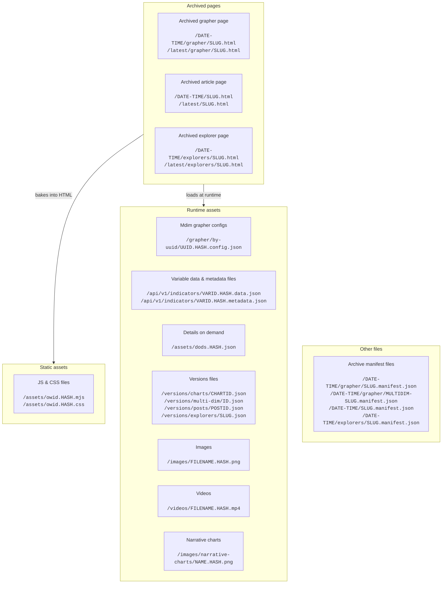

# Archiving content

The code in this directory is used to archive some of our content, powering https://archive.ourworldindata.org.

## Archived assets

The below diagram contains all the various pages and assets that are created/updated as part of each archival build.



Legend:

- all routes are relative to origin, i.e. `/api/v1/indicators` would be archive.ourworldindata.org/api/v1/indicators
- `UUID` is a chart config UUID, e.g. 019542db-2a01-77c3-9f7c-5dfd23e39454
- `VARID` is a variable ID, e.g. 953899
- `CHARTID` is a chart ID, e.g. 64
- `POSTID` is a post ID (Gdoc ID), e.g. `1XFA35qElj_sV42sEk6s3fL9QfD23ZMsV2oYIrwPb_lE`
- `HASH` is always a content hash, i.e. it is a hash of the file content
    - in our case, it is the 10-character prefix of a sha256 hash in [base36 representation](https://en.wikipedia.org/wiki/Base36)
    - an example hash is `2e98tbpu0i`
- `DATE-TIME` is a UTC date string in the format `YYYYMMDD-HHmmss`, e.g. `20250414-074331`
- `SLUG` is a grapher slug (e.g. `life-expectancy`), an article slug (e.g. `poverty`), or an explorer slug (e.g. `co2`)

### Description of assets

- Static assets are those where the path _only_ needs to be known at bake-time, but not at runtime. Those are the JS & CSS files, where we need to put the correct path into the `<script>` and `<link rel="stylesheet">` tags, so they can be loaded correctly.
    - In code, search for `staticAssetMap`.
- Runtime assets are those that are fetched dynamically somewhere in our code. This includes multi-dim, explorer and grapher configs, variable files, images, videos, and DoDs. It also includes a special kind of file only generated for archived pages, the version file.
    - Here, it's important that all calling sites in our code know that they need to alter their fetch requests to get the correct, archived runtime asset.
    - In code, search for `runtimeAssetMap` or `readFromAssetMap`.
- The special versions file contains all the archived versions for a single page. It is mainly used to power the "Go to next version" button in the archive navigation bar, which we need to resolve at runtime because we're not aware of the next version at bake time (because the next version doesn't exist yet at bake time).
    - The file is named after the chart ID / multi-dim ID / post ID and not the slug such that we can also follow versions across slug changes.
    - **Exception:** For explorers, the version file is named after the slug because they don't have IDs.
- There's also a manifest file generated alongside every archived grapher, multi-dim page, explorer, and article. These are written to disk and also stored in the corresponding `archived_<entity>_versions` tables. They are not currently read at runtime, but they help debugging (checksums, commit shas, asset maps, hash-of-inputs that triggered the archival run).
- There are archival pages under `/DATE-TIME/` and, when requested via the CLI flag `--latestDir`, under `/latest/`. The `latest` directory is populated only when that flag is passed (e.g. for convenience in local testing) and otherwise may be missing. It contains a copy of the latest archived version of a page.

### Asset maps

Asset maps are what's being used in code to know how to resolve an asset, for example a variable file. They look like this:

```json
{
    "541219.data.json": "/api/v1/indicators/541219.69npjw5u22.data.json",
    "541219.metadata.json": "/api/v1/indicators/541219.3ip7h74wix.metadata.json",
    "dods.json": "/assets/dods.25l08xug89.json",
    "my-image.png": "/images/my-image.25l08xug89.png"
}
```

## How changes are detected

Obviously, we only want to re-archive a page when its content has been changed in some way - and we also want detecting these changes to be as quick as possible.

We only **consider a grapher page changed** when one of these things happens:

- Its grapher config checksum has been updated (DB: `chart_configs.fullMd5`)
- At least one of its variables has been updated in some way (DB: `variables.dataChecksum` & `variables.metadataChecksum`)

We only **consider a multi-dimensional data page changed** when one of these things happens:

- Its multi-dim config checksum has been updated (DB: `multi_dim_data_pages.configMd5`)
- Any of its associated chart config checksums have been updated (DB: `chart_configs.fullMd5`)
- At least one of its variables has been updated in some way (DB: `variables.dataChecksum` & `variables.metadataChecksum`)

We only **consider an explorer changed** when one of these things happens:

- Its explorer config checksum has been updated (DB: `explorers.configMd5`)
- Any of its associated explorer view chart configs have been updated (DB: `chart_configs.fullMd5`)
- At least one of its variables has been updated in some way (DB: `variables.dataChecksum` & `variables.metadataChecksum`)

> [!NOTE]
> We currently only archive indicator-based and grapher-based explorers. CSV-based explorers are not archived.

We only **consider an article (post) changed** when one of these things happens:

- Its content checksum has been updated (DB: `posts_gdocs.contentMd5`)
- Any interactive charts embedded in the article have changed (using the same logic as above)
- Any of its associated narrative charts have changed
- Any of its associated images

> [!NOTE]
> We don't re-archive articles when only a video changes (unless the video change also updates the `contentMd5`).

Every time the `archiveChangedPages` script is run, we fetch these checksums for each published grapher chart, multi-dim page, explorer, and article, and generate a `hashOfInputs` hash. This hash combines all of these hashes for each page.
We then match these with the `archived_chart_versions`, `archived_multi_dim_versions`, `archived_post_versions`, and `archived_explorer_versions` DB tables respectively, and find any hashes that are not present in those tables yet.
These pages are then the ones that will be re-archived.

The `archiveChangedPages` then takes care of re-archiving only the pages that have changed since the last archival run.

The script is run in Buildkite as part of every content deploy.

## Env variables

There are two env variables relevant to archiving:

- `ARCHIVE_BASE_URL`: This env var is used both in _live_ and in the _archive_ environment.
    - In _live_, when it is set, it will provide archived URLs in the citation blocks of data pages, and also in the embed modal.
    - In _archive_, it is used to determine the base URL of the archive, which are again used for citations, the embed modal, and for the "Copy link" button in grapher.
- `IS_ARCHIVE` should _only_ be set for the `archive` environment. It makes some links point to `https://ourworldindata.org` instead of them being relative, and it also enables the `REDUCE_TRACKING` env variable, which in turn disables Sentry and doesn't show the cookie notice.
    - The JS bundle that is going to be built should always be built with the `IS_ARCHIVE` flag set. This, in turn, also means that the archived JS bundle is going to be different from the live JS bundle.

## Staging servers

> [!NOTE]
> The links in this section lead to a private repo, and are only accessible to the OWID team.

A staging server automatically creates and serves an archive, on port 8789.
This works as follows:

1. As part of the staging server build, [the `create-archive.sh` script](https://github.com/owid/ops/blob/main/templates/owid-site-staging/create-archive.sh) is run.
2. It first truncates / empties the `archived_<entity>_versions` tables.
    - This is done so we only link to archived versions for the few pages for which we actually create an archive, see below.
3. It then runs Vite to build the JS assets needed for the archive.
4. Next, it runs the `yarn buildArchive` command _for just a few, specified pages_.
    - This is done to keep the staging server build time down.
    - We include a representative sample of the various kinds of pages that we archive.
5. We run step (4) again once more, so we have a second copy of the archived pages, and can test both backward and forward navigation.
6. Lastly, after the staging server build is completed, we [serve the archive on port 8789](https://github.com/owid/ops/blob/main/templates/owid-site-staging/serve-archive.sh).
    - We also link to archived pages from the auto-generated comment that `owidbot` puts on the PR.

## Providing citations

When `ARCHIVE_BASE_URL` is set, we provide information about the latest archived version (if any) to the page.

This information is of the type `ArchiveContext`, which can be one of two things:

- When in a normal (_live_) bake, this is going to be basic information about the last archived version, like its URL and date. The object has `{ type: "archived-page-version" }`.
- When in an archival bake, there is extended information relevant for rendering the archived page, like the previous archived version (for backwards navigation), and also the runtime and static asset maps. The object has `{ type: "archive-page" }`.
- You can also conveniently access this information through the `window._OWID_ARCHIVE_CONTEXT` variable.

This information is then used to compute the citation text, and in the latter case also for other considerations like the archive navigation bar.

## Other changes between live and archived pages

Aside from the behind-the-scenes changes, like how variables and other files are loaded, there are also a bunch of user-facing changes to (grapher pages and especially) data pages:

- A changed header, with reduced options (basically only the various OWID logos).
- An added archive navigation bar, which allows the user to navigate between the various archived versions of a page.
- Reduced data page content:
    - No "Explore charts that include this data" section
    - No "Related research and writing" section
    - No fallback image for the chart
    - No dynamic social media preview image
- A changed footer, with fewer options than the live footer.

For articles, the changes are similar:

- A changed header and footer.
- An added archive navigation bar.
- Interactive charts are loaded from the archive via iframes (using the `runtimeAssetMap`).
- Images and videos are loaded from the archive (using the `runtimeAssetMap`).

## Deployment

The archive is built as part of every [deploy-content](https://buildkite.com/our-world-in-data/owid-deploy-content-master) step in Buildkite.
It runs Vite to build the JS assets, and then runs the `yarn buildArchive` command to create the archive.
After that, it sends the changed archive files to R2 (bucket `owid-archive`) using `rclone`.

### Append-only nature of the archive

Overall, the archive is essentially append-only. We don't delete any archived pages, any archived versions of a page, or any assets or variables that were ever created as part of an archive. This is important for the integrity of the archive, for the integrity of past citations, and to ensure that the JS code of past archived pages keeps working.
