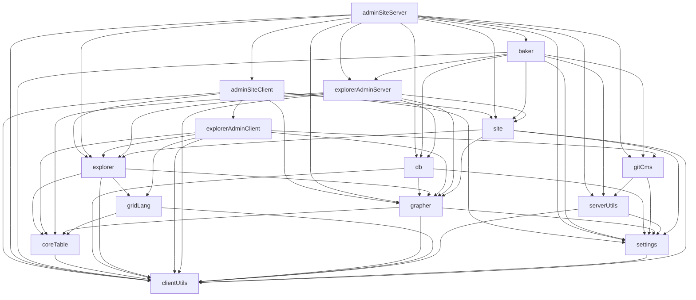

```mermaid
%% This file is manually generated from the different tsconfig files.

graph TD;
    adminSiteClient;
    adminSiteServer;
    baker;
    clientUtils;
    coreTable;
    db;
    explorer;
    explorerAdminClient;
    explorerAdminServer;
    gitCms;
    grapher;
    gridLang;
    serverUtils;
    settings;
    site;

    adminSiteClient --> clientUtils;
    adminSiteClient --> explorer;
    adminSiteClient --> explorerAdminClient;
    adminSiteClient --> grapher;
    adminSiteClient --> settings;
    adminSiteClient --> site;
    adminSiteServer --> adminSiteClient;
    adminSiteServer --> baker;
    adminSiteServer --> clientUtils;
    adminSiteServer --> db;
    adminSiteServer --> explorer;
    adminSiteServer --> explorerAdminServer;
    adminSiteServer --> gitCms;
    adminSiteServer --> grapher;
    adminSiteServer --> serverUtils;
    adminSiteServer --> settings;
    adminSiteServer --> site;

    baker --> clientUtils;
    baker --> db;
    baker --> explorerAdminServer;
    baker --> gitCms;
    baker --> serverUtils;
    baker --> settings;
    baker --> site;

    coreTable --> clientUtils;

    db --> clientUtils;
    db --> grapher;
    db --> settings;

    explorer --> clientUtils;
    explorer --> coreTable;
    explorer --> grapher;
    explorer --> gridLang;

    explorerAdminClient --> clientUtils;
    explorerAdminClient --> coreTable;
    explorerAdminClient --> explorer;
    explorerAdminClient --> gitCms;
    explorerAdminClient --> grapher;
    explorerAdminClient --> gridLang;

    explorerAdminServer --> clientUtils;
    explorerAdminServer --> coreTable;
    explorerAdminServer --> db;
    explorerAdminServer --> explorer;
    explorerAdminServer --> grapher;
    explorerAdminServer --> site;

    gitCms --> serverUtils;
    gitCms --> settings;

    grapher --> clientUtils;
    grapher --> coreTable;
    grapher --> settings;

    gridLang --> clientUtils;
    gridLang --> coreTable;

    serverUtils --> clientUtils;
    serverUtils --> settings;

    settings --> clientUtils;

    site --> clientUtils;
    site --> explorer;
    site --> grapher;
    site --> settings;
```
