# Architecture

Our World in Data is a living online publication, whose mission is to make data and research on the world's biggest problems accessible and understandable.

This document is the "missing overview" of our architecture. It will be folded back into the overall docs for our site.

## Overview

- Our World In Data is a _statically rendered_ ("JAMstack") publication with no public facing backend.
- It has two primary codebases, a Typescript one used to build the site ([owid-grapher](https://github.com/owid/owid-grapher)) and a Python one used to build its datasets ([etl](https://github.com/owid/etl)).
- There four different types of users of our infrastructure: _readers_, _authors_, _data scientists_ and _engineers_.

```mermaid
graph TB

reader(["👤 reader"]) -->|reads| owid[Our World In Data site]
author(["👤 author"]) -->|writes articles| owid
data(["👤 data scientist"]) -->|manages data| owid
engineer(["👤 engineer"]) -->|deploys changes| owid
```

### Readers

- Readers interact with a fully static published site, a snapshot of our work that functions with no backend whatsoever. The site is published to Netlify, with secondary files in S3.
  - This leads to very high performance and high uptime for the site
- Although Netlify itself is a CDN, we also use CloudFlare on top for data resources to vastly reduce bandwidth costs to Netlify.
- Since the site is static, this means that all interactivity is client side and all data used by the site is pre-determined at bake time, either in the snapshot sent to Netlify, or in S3.
- Algolia is the only notable service that is not static. It provides a search API on the client.

```mermaid
graph TB

subgraph live[live site]
cloudflare --> netlify
cloudflare --> s3
algolia
end

reader(["👤 reader"]) -->|data files| cloudflare[cloudflare CDN]
reader --> netlify
reader --> algolia
```

### Authors

- Authors do their writing and editorial process on Google Docs
  - When the writing is ready, they copy-paste it to Wordpress and tidy up before publishing
- Authors use the Grapher admin site to create and manage charts and small datasets
- A service called the _baker_ generates a snapshot of the site and deploys it
- Wordpress and the Grapher admin are hosted on a Digital Ocean droplet called `live`, authenticated by Gsuite login

```mermaid
graph TB

subgraph admin[admin site]
    grapher[grapher admin]
    wordpress[wordpress admin]
    grapher --> mysql
    wordpress --> mysql
    grapher --> baker["⚙️ baker"]
    wordpress --> baker
    baker --> mysql
end

baker -->|deploy| live[live site]

author(["👤 author"]) -->|manage charts| grapher
author -->|write articles| gdocs["Google Docs"]
gdocs -.->|copy paste| wordpress
```

- The Typescript code powering this work is in the public [owid-grapher](https://github.com/owid/owid-grapher) monorepo
- Some basic orchestration lives in the private [ops](https://github.com/owid/ops) repo

### Data scientists

- Data scientists are responsible for finding and importing data from upstream providers, and putting it through our editorial process
- They may use the grapher admin for small datasets, or our ETL for larger datasets
- Our ETL is a custom Python project designed to be executable by the public
- It defines the following stages of data processing:
    - `upstream`: the original data with the provider
    - `snapshot`: a copy of the original data, for reproducibility
    - `meadow`: the data reformatted to a standard format
    - `garden`: the data harmonized to use reference names for countries and regions
    - `mysql`: the data transformed for our charting tool Grapher
- A common challenge is updating existing charts to use newer available data
    - The grapher admin supports a chart revision tool that helps with this process

```mermaid
graph TB

subgraph etl["ETL"]
    direction LR
    upstream -.->|save| snapshot
    snapshot -->|reformat| meadow -->|harmonize| garden
end

grapher[grapher admin]
grapher --> mysql

dm(["👤 data scientist"]) -->|manage large datasets| etl
dm -->|manage charts & small data| grapher
etl --> mysql
```

Documentation on our data pipeine is available [here](https://docs.owid.io/projects/etl/en/latest/).

### Engineers

- Engineers are responsible for deploying changes to the site
- They tend to work either in the Typescript [owid-grapher](https://github.com/owid/owid-grapher) codebase or the Python [etl](https://github.com/owid/etl) codebase
    - Each of these repos describes its own dev setup
- Developers have access to staging environments
- Operationally, internal tools run off a number of small hand-managed servers in DigitalOcean, and off a high-capacity Hetzner dedicated server called `foundation`
    - `foundation` is used as a host for LXC containers
- Most development is done on local machines, using Docker for supporting services
- We track our work using Github issues and Github Projects
- We are increasingly using Buildkite for CI, and LXC containers for new services we need

A map of our infrastructure is as follows:

## Transitions underway

### Google Docs and ArchieML

- We are currently moving away from Wordpress and towards Google Docs with [ArchieML](http://archieml.org/) markup for authoring
    - This balances ease of authoring and ease of review in the editorial process
- Our goal in 2023 is to completely move off of Wordpress and convert all existing content to Google Docs

## New fast track for small data

- Part of the `grapher-admin` is dedicated to importing small datasets
  - We nickname it the "fast track"
- We are building a new fast track on top of the ETL, using Google Sheets as the authoring tool
- This will make the ETL authoritative for data values, but non-authoritative for metadata
  - Data curation tools on top of MySQL may layer metadata edits on top, making MySQL authoritative for metadata