# Admin site

- Authors do their writing and editorial process on Google Docs
  - When the writing is ready, they copy-paste it to Wordpress and tidy up before publishing
- Authors use the Grapher admin site to create and manage charts and small datasets
- A service called the _baker_ generates a snapshot of the site and deploys it
- Wordpress and the Grapher admin are hosted on a Digital Ocean droplet called `live`, authenticated by Gsuite login

```mermaid
graph TB

subgraph admin[admin site]
    grapher[grapher admin]
    wordpress[wordpress admin]
    grapher --> mysql
    wordpress --> mysql
    grapher --> baker["⚙️ baker"]
    wordpress --> baker
    baker --> mysql
end

baker -->|deploy| live[live site]

author(["👤 author"]) -->|manage charts| grapher
author -->|write articles| gdocs["Google Docs"]
gdocs -.->|copy paste| wordpress
```

- The Typescript code powering this work is in the public [owid-grapher](https://github.com/owid/owid-grapher) monorepo
- Some basic orchestration lives in the private [ops](https://github.com/owid/ops) repo

