# Live site

- Readers interact with a fully static published site, a snapshot of our work that functions with no backend whatsoever. The site is published to Netlify, with secondary files in S3. 
  - This leads to very high performance and high uptime for the site
- Although Netlify itself is a CDN, we also use CloudFlare on top for data resources to vastly reduce bandwidth costs to Netlify.
- Since the site is static, this means that all interactivity is client side and all data used by the site is pre-determined at bake time, either in the snapshot sent to Netlify, or in S3.
- Algolia is the only notable service that is not static. It provides a search API on the client.

```mermaid
graph TB

subgraph live[live site]
cloudflare --> netlify
cloudflare --> s3
algolia
end

reader(["👤 reader"]) --> browser -->|data files| cloudflare[cloudflare CDN]
browser --> netlify
browser -->|search API| algolia
```

