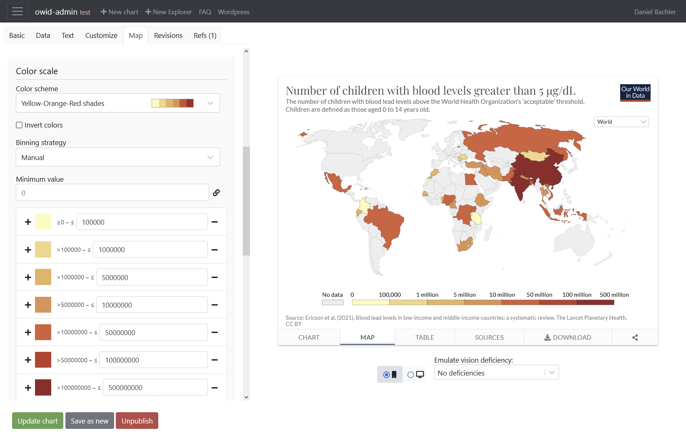
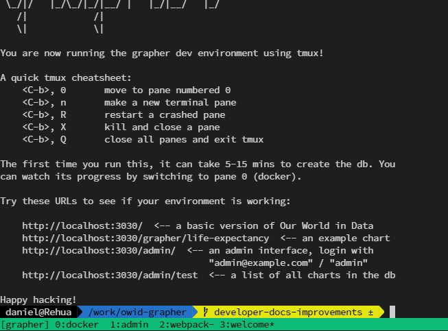

# Local development setup with MySQL and the Grapher admin

This page describes how to set up a MySQL database loaded with example charts so you can use the Admin UI to visually create and edit charts.



## Prerequisites

This option uses `make` to spin up all the services with a single command, but it requires a few utilities to be installed:

-   [Docker](https://www.docker.com/get-started)
-   [Node.js and Yarn](docs/local-typescript-setup.md)
-   [tmux](https://github.com/tmux/tmux/wiki/Installing#binary-packages)

If you're using Windows, we recommend you use the Windows Subsystem for Linux, where you'll require some additional utilities:

```bash
apt install -y build-essential finger
```

## Optional prequisites

If you want to work with the explorer admin then you need to clone the "owid-content" folder as a **sibling** to the owid-grapher. Note that this is not required just to create or edit single charts which is normally sufficient for development of new features or bug fixes.

```bash
git clone https://github.com/owid/owid-content
```

## Starting our development environment

Make a copy of `.env.example-grapher` for the server to configure itself with.

```bash
cp .env.example-grapher .env
```

Then run:

```bash
make up
```

This should fire up a tmux console with 4 tabs:

1. A tab that gives a brief overview of how to use this tmux setup
2. A tab that outputs the Docker compose container logs
3. A tab that shows the result of the TypeScript watch compiler process
4. A tab that shows the output of the webpack and admin server watch processes

The first time you run this it will take a while to download and set up the database (10-20 minutes is expected). Switch to the database tab and wait until you see this message:

```
✅ All done, grapher DB is loaded ✅
```



Now you can open [http://localhost:3030/admin/charts](http://localhost:3030/admin/charts) and start creating charts. Any changes to the TypeScript code you make will be automatically compiled, but you will have to refresh your page to see the changes.

## Inspecting the databases

For all operating systems, we recommend using [DBeaver](https://dbeaver.io/).

The MySQL server is exposed on port **3307** as opposed to port 3306 to avoid port conflicts with any local SQL clients you may have running.

Use this connection configuration:
| key | value |
|---|---|
| host | `localhost` |
| port | `3307` |
| username | `root` |
| password | `weeniest-stretch-contaminate-gnarl` |

(The root development password is set in this [docker-compose file](https://github.com/owid/owid-grapher/blob/master/docker-compose.grapher.yml#L40))

We also have [a schema diagram for reference.](screenshots/er_diagram.png)

Note that in the MySQL database that was set up, the `data_values` table is incomplete – it only contains data used in charts. In production, this table is >30GB (uncompressed) and contains unreviewed and undocumented data, so we currently don't offer a full export of it.

## Resetting your environment

If you've modified or broken your database and want to start over from scratch, you'll need to clear the docker volumes that the database persists on.

To do so, get their names

```bash
docker volume ls
```

and remove them with

```bash
docker volume rm volume_name
```

The names of the volumes should usually be something like `owid-grapher_mysql_data` and `owid-grapher_mysql_data_public`.

You can also remove your local copies of the database exports if you want to download the latest version. Skip this step if you want your database to be exactly the same as it was on your last setup.

```bash
rm tmp-downloads/*
```

With that done, the next time you run `make up`, the database files will be re-downloaded.

A new database will then be created (expect another 10-20 minutes.)
