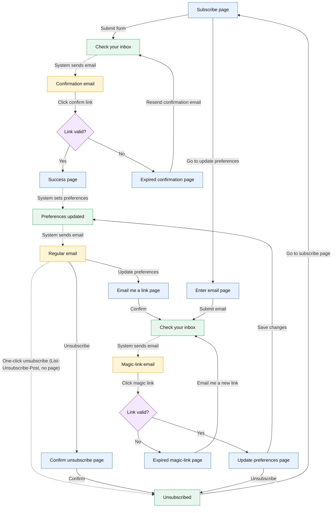

# Email Notifications — Project State & Plan

---

## Background

**Goals:** (1) let users subscribe to a custom combination of topic areas, content
types, and frequency; (2) **migrate the Data Insights and Immediate Update
newsletters** into the new system — each is representable as a notification
configuration (see P2.2); (3) future-proof the
system for features built on top later.

**Explicitly out of scope:** an email template editor (hard-coded templates,
engineer-edited — consistent with the react-email decision); behavior-based logic
(no "nudge if inactive" flows); **migrating The OWID Brief** (stays in Mailchimp —
see P3).

**Content requirements** (all already implemented): emails contain the
latest-feed items filtered by the user's preferences; data insights carry their
full content rather than the latest feed's faded-out preview (preserve this in
P1.2's redesign); one email per frequency window covering everything since the
last notification; frequency is "up to" — no new items means no email
(`sendEmailNotifications.ts:305-308` skips such subscribers).

---

## TL;DR

dda8f0f8 implemented the core loop: the `/subscribe` form writes to a Cloudflare D1 database, and
the `sendEmailNotifications` job collects new site content from MySQL, renders an email,
and can send it via Postmark.

However, this is only a subset of the flow diagram specified later in this document.

The remaining work falls into four buckets:

1. **Complete the v1 flows** — double opt-in confirmation, magic-link
   preferences management, confirm-unsubscribe.
2. **Launch blockers** — infra that doesn't exist yet (real D1 DB, scheduled send
   job, secrets, WAF rule), bot protection, deliverability, and send-job robustness.
3. **Product/design work** — implementing signup/preference forms, signup prompts, and react-email template integration
4. **Post-launch migrations** — import the Data Insights and Immediate Update
   newsletter subscribers into the new system (project goal 2 — P2.2). Migrating
   the "OWID Brief" itself is explicitly out of scope for this project and stays
   a future cycle (P3, XL).

---

## Architecture in one table

One subscribe form drives **two independent subscriptions**:

| System            | Owns                                                                           | Opt-in                                  | Unsubscribe                       | Gating env vars                                                                      |
| ----------------- | ------------------------------------------------------------------------------ | --------------------------------------- | --------------------------------- | ------------------------------------------------------------------------------------ |
| **Mailchimp**     | "The OWID Brief" (+ legacy Data Insights / Immediate Update groups until P2.2) | Double                                  | Mailchimp's own footer            | `MAILCHIMP_*` (skipped if unset)                                                     |
| **D1 + Postmark** | New per-topic/content-type notifications                                       | Single as of dda8f0f8; **double in v1** | Token link → flips D1 status only | `EMAIL_NOTIFICATIONS_DB` (hard-required), `POSTMARK_SERVER_TOKEN` (skipped if unset) |

The notification unsubscribe link does not touch Mailchimp. The send job
(`baker/emailNotifications/`) runs on our own infra, reads D1 remotely via the Cloudflare
HTTP API (`emailNotificationsD1.ts`), pulls content from MySQL, and sends via Postmark's
`broadcast` stream. The subscribe/unsubscribe endpoints are Cloudflare Pages Functions
(`functions/api/email-notifications/`).

---

## The v1 flow diagram (source of truth)

This diagram is the canonical v1 scope (it supersedes the earlier Notion diagram).



---

## Built vs. v1 scope

What the diagram specifies, against what exists on the branch:

| Diagram element                                     | Status                                             | Notes                                                                                        |
| --------------------------------------------------- | -------------------------------------------------- | -------------------------------------------------------------------------------------------- |
| Subscribe page + form (`/subscribe`)                | ✅ built                                           | `site/EmailNotificationsSubscribeForm.tsx`, `functions/api/email-notifications/subscribe.ts` |
| Confirmation email + confirm link (double opt-in)   | ❌ missing                                         | Code subscribes immediately and sends a welcome email instead                                |
| "Link valid?" checks / expiring links               | ❌ missing                                         | Only one **permanent** UUID token per user; nothing expires                                  |
| Success / Expired-link pages                        | ❌ missing                                         |                                                                                              |
| Enter-email page → magic-link email                 | ❌ missing                                         |                                                                                              |
| Update-preferences page (view + save + unsubscribe) | ❌ missing                                         | Interim: re-subscribing with the same email silently overwrites preferences                  |
| "Email me a link" page (from regular email)         | ❌ missing (kept by design — see Design decisions) |                                                                                              |
| Confirm-unsubscribe page                            | ❌ missing                                         | Current unsubscribe is a **one-shot GET** — see P0.2                                         |
| Regular notification email                          | ✅ built                                           | `baker/emailNotifications/NotificationEmail.tsx` + send job                                  |
| Unsubscribed page                                   | ⚠️ partial                                         | Rendered by the GET unsubscribe endpoint (`renderMessagePage`)                               |

Two consequences of the missing pieces worth naming:

- **Silent reactivation/overwrite:** `upsertNotificationPreferences`
  (`subscribe.ts:142-152`) reactivates unsubscribed users and overwrites preferences
  with no verification and no notification (only _new_ users get an email). Anyone who
  knows an address can re-subscribe someone who deliberately unsubscribed. The
  uniform pending-confirmation flow (P0.1) fixes this: no change ever
  applies without proof of inbox control.
- **Scanner-prefetch unsubscribes:** the unsubscribe endpoint mutates state on GET
  (`unsubscribe.ts:13`). Mail security scanners (Outlook SafeLinks, corporate
  gateways) prefetch links in emails and will silently unsubscribe real users. The
  diagram's confirm-unsubscribe page (button → POST) fixes this; it lands in P0.1/P0.2.

---

# Remaining work

## P0 — Launch blockers

### P0.1 — Complete the v1 flows from the diagram

The big one. Sub-items, roughly in dependency order:

- **Migration `0002`** — token model: purpose-scoped tokens (confirm / magic-link /
  unsubscribe) with expiry, a `pending` user status, and storage for the preferences
  chosen at signup until they're confirmed. The current schema has one permanent
  UUID per user and only `subscribed`/`unsubscribed` statuses
  (`d1/email-notifications/migrations/0001_...sql`).
- **Double opt-in** — subscribe endpoint stores pending state and sends a
  confirmation email (repurpose the current welcome email in
  `functions/_common/emailNotifications.ts`); new confirm endpoint; success and
  expired-link pages. Every submission takes this same pending-confirmation path
  regardless of the email's current state (see Design decisions): confirm
  applies the pending preferences — new user →
  subscribed, confirmed user → preferences replaced, unsubscribed → reactivated.
  Only the email copy differs by state.
- **Magic-link preferences management** — enter-email page, request-link endpoint
  (unknown emails get the identical "Check your inbox" response and **no
  email**), magic-link email,
  and an update-preferences page that loads current preferences by token and saves
  changes. Needs a GET-preferences-by-token API; the form UI can reuse
  `EmailNotificationsSubscribeForm`. Per the project brief's "unified interface"
  requirement, the page also shows a **fail-soft OWID Brief toggle** — one
  Mailchimp member lookup to display status, one update on save; hide the toggle
  if Mailchimp errors (see Design decisions).
- **Confirm-unsubscribe page** — replace the one-shot GET with a page whose button
  POSTs (fixes scanner prefetch). Also add a separate bare POST endpoint, no page,
  for one-click unsubscribe — the target of the `List-Unsubscribe-Post` header
  (P0.3). This edge is in the flow diagram.
- **Expired-link pages** fall out of token expiry. Each gets a resend button:
  POST the expired token → fresh token + new email (see Design decisions).

### P0.2 — Send-job robustness

The per-subscriber loop (`baker/emailNotifications/sendEmailNotifications.ts:303-358`)
has no error isolation: one Postmark failure (e.g. a 422 on an inactive address)
throws and aborts the run for every remaining subscriber. And a crash between
`sendViaPostmark` and `recordSentEmail` sends a duplicate email on the next run.

- Wrap each subscriber in try/catch; collect failures; exit non-zero at the end if
  any failed (so the Buildkite build fails and alerts, P0.7) without starving the
  rest of the list.
- Consider recording intent before sending (or tolerating rare duplicates —
  document the choice).
- Sends are sequential with two remote D1 round-trips per subscriber
  (`recordSentEmail`). Fine at launch scale; **revisit before the Brief migration
  (P3)** — Postmark has a batch API.

### P0.3 — Deliverability essentials

Modern bulk-sender rules (Gmail/Yahoo) and spam scoring effectively require:

- **`List-Unsubscribe` + `List-Unsubscribe-Post` headers** (one-click unsubscribe) on
  the Postmark payload — currently absent in both send paths
  (`sendEmailNotifications.ts` `sendViaPostmark`, `functions/_common/emailNotifications.ts`
  `sendPostmarkEmail`). One-click is a background **POST with no page shown** — it
  must hit the bare unsubscribe endpoint from P0.1, bypassing the confirm page.
- **Plaintext part (`TextBody`)** — currently HTML-only. Comes for free with the
  react-email migration — don't hand-roll it; sequence this after (or as part
  of) P1.2's template migration.
- **SPF / DKIM / DMARC** for `updates@ourworldindata.org`, plus Postmark
  broadcast-stream reputation/warm-up. Non-code, ops work.

### P0.4 — Create the real D1 database(s)

No database exists; all three `wrangler.jsonc` blocks carry the placeholder id
`00000000-0000-0000-0000-000000000000` (`wrangler.jsonc:41,74,115`).

- **Prod D1 is needed regardless:** `wrangler d1 create owid-email-notifications`,
  paste the id into the `production` block, apply migrations `--remote`, point the
  send job's server-side secrets (`EMAIL_NOTIFICATIONS_D1_DATABASE_ID` etc.) at it.
- **Remote staging D1 too** (see Staging & testing strategy): `wrangler d1 create
owid-email-notifications-staging`, paste the id into both staging blocks, apply
  migrations `--remote`. Used only by the Cloudflare preview for pre-launch smoke
  testing — nothing routine depends on it.

### P0.5 — Bot protection (Turnstile) on the subscribe endpoint

The endpoint has no CAPTCHA; its only mitigation is IP rate-limiting that is a
**no-op on Cloudflare Pages** (the binding only works on Workers — the code says so
itself, `subscribe.ts:42-46`). An unprotected endpoint that triggers Postmark and
Mailchimp emails to arbitrary addresses is a real abuse vector — and double opt-in
makes confirmation-email spam _more_ attractive, so this stays P0.

- Mirror the donation flow: `<Turnstile>` client-side + `siteverify` server-side.
  Reference: `functions/donation/donate.ts` (`isCaptchaValid`) and
  `site/DonateForm.tsx`.
- **Do NOT copy donation's hard-requirement** (donation 500s if
  `TURNSTILE_SECRET_KEY` is unset). Skip verification when the secret is unset —
  the pattern Postmark/Mailchimp already use — so local dev and staging need zero
  Turnstile config. `siteverify` is a plain HTTPS POST, so it works from
  wrangler-local too.
- While in there: tighten `Access-Control-Allow-Origin: *` (`subscribe.ts:17`) to
  the site origin. Minor, but free.
- Hostname allowlisting on staging is real work if the _real_ widget is ever wanted
  there — see "Staging & testing strategy".

### P0.6 — Ops checklist

- **WAF rate-limiting rule:** because the code-level limiter doesn't run on Pages,
  `/api/email-notifications/*` needs a zone-level WAF rate-limiting rule (dashboard →
  Security → WAF), per zone. Reference: `functions/README.md` → "Rate limiting".
- **Cloudflare dashboard secrets** for the deployed functions, scoped Preview and
  Production separately: `POSTMARK_SERVER_TOKEN`, `MAILCHIMP_API_KEY`,
  `MAILCHIMP_API_SERVER`, `MAILCHIMP_NEWSLETTER_LIST_ID`,
  `MAILCHIMP_OWID_BRIEF_INTEREST_ID` (+ `TURNSTILE_SECRET_KEY` after P0.5).
- **Request Postmark account approval early:** the account only allows 100 real
  sends until approved, and the review has human turnaround. Launch requires it;
  don't leave it to launch week. (Dev never spends real sends — see "Email sending
  during development" under Staging & testing strategy.)
- **Apply D1 migrations in the staging bootstrap:** no `owid-site-staging/*.sh` runs
  `wrangler d1 migrations apply`, so a fresh LXC container has no tables and the
  subscribe function errors. Add
  `yarn wrangler d1 migrations apply owid-email-notifications-staging --local`
  to `grapher-build.sh` (or before `dev-site-refresh.sh` starts the server).

### P0.7 — Schedule the send job on Buildkite

**Nothing sends automatically today.** `sendEmailNotifications` is only a CLI
(`yarn sendEmailNotifications <daily|weekly>`); no scheduler exists in this repo.
OWID runs cron-like jobs as **Buildkite scheduled pipelines**, defined in the ops
repo under `ops/.buildkite/`. The closest precedent is
`ops/.buildkite/grapher/algolia.yml`: it runs make targets on the prod admin
server (`agents: queue: "owid-admin-prod"`, via `sudo su - owid -c 'cd
/home/owid/owid-grapher && make ...'`), with the schedule itself configured in the
Buildkite UI. Add a pipeline of that shape for the send job — either two (daily,
weekly) or one taking the frequency as an argument — plus the server-side secrets
it needs on that machine (`EMAIL_NOTIFICATIONS_CLOUDFLARE_*`,
`POSTMARK_SERVER_TOKEN`). Failure alerting comes with Buildkite: P0.2 makes the
job exit non-zero on partial failure, which fails the build.
**Deliberately last among P0s: turning on the schedule is the launch switch.**

---

## P1 — Product & design work

### P1.1 — Migrate remaining site signup surfaces

Only `/subscribe` uses the new form. Four surfaces still embed the old Mailchimp form:

- Header "Subscribe" dropdown — `site/SiteNavigation.tsx:207`
- Floating sticky widget — `site/SiteTools.tsx:32`
- Homepage inline signup — `site/gdocs/components/HomepageIntro.tsx:311-312`
- Latest / Data-Insights index — via `site/NewsletterSignupBlock.tsx:19`
  (used from `site/latest/LatestSearch.tsx:190` and `LatestSearchSkeleton.tsx`)

A design in Figma is underway. It's similar to the current signup form but slightly more stateful.

It will have 2 checkboxes:

1. Signup for OWID Brief
2. Signup for topic notifications

If only the first box is checked, the button says "subscribe"

If the second box is checked, the button says "See subscription options" and takes you to the /subscribe page

### P1.2 — Email template design + react-email migration

The email is hand-rolled inline-style React via `renderToStaticMarkup` — no email
library, `<div maxWidth>` + `inline-block` "buttons" that break in Outlook (no
table/VML fallback) (`NotificationEmail.tsx:64,105,149`). Migrate the template to
`@react-email/components`, which also produces the
plaintext part for P0.3. This is where the **designer's** email design lands — they
design against react-email's component set. Per the project brief, data insights
must keep their full content in the email (no faded-out preview like the latest
feed), and templates stay hard-coded/engineer-edited — no template editor.
Design input from the current "Update" RSS email (see P2.2): a featured slot for
the newest post (title, excerpt, hero image), a plain link list titled "Recent
articles, updates, and announcements", and an OWID Brief cross-promo footer. The
new system sends only items new since the last email, so decide whether to keep
a "recent articles" tail of older posts and the Brief cross-promo.

### P1.3 — Subscribe form design polish

Current SCSS is a basic first pass: plain `$blue-90` button (not the site's vermillion
`Button`), no responsive breakpoints. Includes the compact variant from P1.1 if needed.

- Files: `site/css/email-notifications-subscribe-form.scss`,
  `site/EmailNotificationsSubscribeForm.tsx`.

### P1.4 — Topic tag depth + server-side validation

(a) Decide whether users pick sub-topics vs just top-level areas (form currently
exposes only top-level areas); (b) topic tags are **client-trusted** — the server
accepts up to 64 arbitrary ≤100-char strings without validating against the real tag
graph (`packages/@ourworldindata/types/src/EmailNotificationsTypes.ts:40-42`). Minor
hardening; validating against the tag graph requires the functions to know it
(build-time constant or KV/D1 lookup).

---

## P2 — Quality hardening

### P2.1 — Tests for the subscribe/confirm/preferences/unsubscribe functions

Unit tests exist for `emailNotificationsUtils` and the types, but not for the
endpoints (D1 upserts, Mailchimp upsert, emails, token flows). P0.1 triples the
endpoint surface, so budget grows accordingly; write them alongside P0.1 rather
than after.

### P2.2 — Migrate the Data Insights & Immediate Update newsletters

**Project goal 2 from the original brief** — each existing newsletter becomes a
notification configuration in the new system. Post-launch: the system must be
live and stable before importing an existing subscriber base. Sub-items:

- **Preference mapping.** Both newsletters are Mailchimp RSS-to-email campaigns
  over baker-generated atom feeds, checked daily at 6pm and sent only when the
  feed has new entries — already the new system's `daily` "up to" semantics
  (see Design decisions). Immediate Update
  consumes `atom-no-topic-pages.xml` (articles only; topic-page announcements
  deliberately excluded and sent manually — `baker/siteRenderers.tsx:263-272`)
  → `contentTypes: ["article"]`, all topics, daily. Data Insights consumes
  `atom-data-insights.xml` → `contentTypes: ["data-insight"]`, all topics,
  daily. Match the 6pm send time in the P0.7 schedule so migrated subscribers
  notice no rhythm change.
- **Subscriber import.** Export the two Mailchimp audiences ("Data Insights" is
  interest group id 16 in `site/NewsletterSubscription.tsx:92`; "Immediate
  Update" is a legacy group no longer offered in the form — its only code
  footprint is the feed it consumes) and insert into D1 as **confirmed** users —
  they already opted in via Mailchimp, so no re-confirmation email (standard
  practice, but note it deliberately bypasses the double opt-in flow).
- **Retire the Mailchimp side.** Remove the Data Insights checkbox from the old
  form (or complete P1.1 first and never rebuild it), archive the groups in
  Mailchimp, and notify subscribers of the change if comms wants to.

---

## P3 — Future cycle: migrate the "OWID Brief" off Mailchimp

### P3.1 — OWID-owned Brief (Gdocs-authored, archived on site, Postmark-sent)

Feasible and meaningfully de-risked — the codebase pre-cuts the seam
(`subscribeToOwidBrief` already routes to Mailchimp today; you'd reroute to D1).
Most pillars exist:

- **Author in Gdocs:** a `Brief` gdoc type is a thin subclass — clone
  `GdocAnnouncement.ts` (77 lines).
- **Archive on site:** data insights are already a dated, per-issue series — direct
  precedent (`SiteBaker.bakeDataInsights`, `getPrefixedGdocPath`).
- **Send via Postmark:** `sendViaPostmark` + `recordSentEmail` + the email renderer
  are reusable — but see P0.2's scale note: the sequential per-subscriber send with
  per-user D1 round-trips won't survive a full newsletter list; plan for Postmark's
  batch API.

Net-new work: the Brief gdoc type, an archive index page, a single-issue send path,
moving Brief subscribers into D1, scheduling. Plan the non-code risks early:
deliverability/domain auth and migrating the existing Mailchimp subscriber list.
Recommend a dedicated design doc before committing.

- Key files: `db/model/Gdoc/GdocAnnouncement.ts`, `db/model/Gdoc/GdocFactory.ts:56,411`,
  `packages/@ourworldindata/components/src/GdocsUtils.ts:99`, `baker/SiteBaker.tsx:935`,
  `baker/emailNotifications/sendEmailNotifications.ts:201,266`.

---

## Priority summary

| #    | Item                                                       |
| ---- | ---------------------------------------------------------- |
| P0.1 | Complete v1 flows (double opt-in, magic links, prefs page) |
| P0.2 | Send-job robustness                                        |
| P0.3 | Deliverability (one-click, plaintext, DNS)                 |
| P0.4 | Create real D1 database(s)                                 |
| P0.5 | Bot protection (Turnstile)                                 |
| P0.6 | Ops checklist (WAF, secrets, staging migrations)           |
| P0.7 | Buildkite send-job schedule (the launch switch)            |
| P1.1 | Migrate 4 legacy signup surfaces                           |
| P1.2 | Email design + react-email migration                       |
| P1.3 | Subscribe form design polish                               |
| P1.4 | Topic tag depth + server validation                        |
| P2.1 | Endpoint tests                                             |
| P2.2 | Migrate Data Insights + Immediate Update newsletters       |
| P3.1 | Migrate OWID Brief off Mailchimp                           |

Suggested sequence: P0.4/P0.6 (mechanical, unblock testing) →
P0.1/P0.2/P0.5 (the eng track) → P0.3 → P1.x in parallel with design →
feature-flag flip + P0.7 last (launch).

---

## Design decisions and rationale

**Decision: launch behind a feature flag, not a hard cutover.** The new signup
surfaces ship dark behind the existing build-time `FEATURE_FLAGS` mechanism
(`settings/clientSettings.ts`), so work merges to master continuously and
staging builds can run with the flag on while production stays off. Launch is
then two switches: enable the flag (site surfaces go live), then turn on the
Buildkite schedule (P0.7, emails start sending).

**Decision: the preferences page includes an OWID Brief toggle.**
The project brief requires the Brief (Mailchimp) and the new notifications to be
"managed through a unified interface, so users won't notice any difference". The
subscribe form already does this (one form, two systems); the magic-link
update-preferences page will too: one Mailchimp member lookup (GET by email) to
show current Brief status, one update on save. Consent is sound — the magic
link just proved inbox control, so enabling the Brief from there is equivalent
to double opt-in. **Fail soft:** if the Mailchimp API errors or is slow, hide
the toggle and render the rest of the page — D1 preferences are never hostage
to Mailchimp availability. Expectation to keep in mind: unification is only
achievable on our surfaces; Brief emails still carry Mailchimp's own footer and
land users in Mailchimp's interface until P3.

**Decision: every subscribe-form submission takes the same
pending-confirmation flow, regardless of the email's current state.** Submit
always lands on "Check your inbox" and always sends an email — a confirmation
email for a new address; for an existing subscriber (confirmed or unsubscribed)
the same email in spirit, "click to apply these preferences", with the newly
chosen preferences stored as pending until clicked. Clicking confirm applies
them: new user → subscribed; confirmed user → preferences replaced;
unsubscribed user → reactivated. One code path covers all three states. This
kills the silent-overwrite vector completely — the subscribe form is public and
tokenless, so without this, anyone who merely knows an address could rewrite
its preferences or re-subscribe it — and gives no-enumeration for free, since
the page response is identical whether the email was known or not. For the
**magic-link request with an unknown email**: identical "Check your inbox"
page, and send nothing (a courtesy "you're not subscribed" email isn't an
enumeration risk, but it turns the endpoint into a tool for sending unsolicited
mail to arbitrary addresses — the very thing Turnstile and the WAF rule
contain; silence is Mailchimp's pattern too). The resulting invariant across
all surfaces: **no preference change or reactivation ever happens without
exactly one proof of inbox control** — the form path proves it after choosing
preferences, the magic-link path before (a save from a magic-link session
applies immediately; the link itself was the proof). The diagram's shape is
unchanged — for existing subscribers only the email copy and the effect of
confirm differ, which lives in P0.1's copy specs, not new boxes.

**Decision: expired-link pages get a resend button.** Each expired
page offers one action powered by the expired token itself: the
expired-confirmation page has "Resend confirmation email" (fresh confirmation
token, re-sent email — the pending preferences from signup are preserved, so
nothing is re-entered); the expired-magic-link page has "Email me a new link"
(runs the existing request-link path for that user, no email typing). Safe
because an expired token's only remaining power is causing an email to be sent
to its own address — exactly what the enter-email page already allows anyone to
do. Both are POSTs (scanner-prefetch rule) and email-sending endpoints, so they
sit behind the same WAF rate limit as the rest (P0.6). Both edges are in the
flow diagram; the work lands in P0.1.

**Decision: the one-click unsubscribe edge is in the diagram.**
`List-Unsubscribe-Post` (required by Gmail/Yahoo bulk-sender rules) is a
background POST with no page shown, bypassing the confirm-unsubscribe page.
The work lands in P0.1 (bare POST endpoint) and P0.3 (headers).

**Decision: the "Email me a link" indirection stays.** The in-email unsubscribe
link is tokenized, so one might expect the "update preferences" link to go
directly to the preferences page. Instead the flow deliberately mirrors OWID's
current Mailchimp newsletters (whose "Update your preferences" link lands on an
"Email Me A Link" page — Mailchimp's own post-2022 behavior), and it encodes a
sensible privilege tier: the token embedded in every email can only unsubscribe or
_request_ a magic link, while viewing/editing preferences requires proving control
of the inbox right now via a short-lived link. Keeping it also means one consistent
preferences UX across the Mailchimp Brief and the new system while they coexist.
Revisit (direct tokenized links, as Substack/beehiiv do) only if the friction shows
up in practice, likely post-Brief-migration.

**Decision: no "immediate" frequency is needed for the newsletter
migration.** Despite its name, the "Immediate Update" newsletter is a Mailchimp
RSS-to-email campaign over the baker-generated `atom-no-topic-pages.xml` feed —
the code comment at `baker/siteRenderers.tsx:263-265` documents exactly this.
Mailchimp checks the feed daily at 6pm and sends only when there is a new entry,
which is precisely the new system's `daily` "up to" behavior. Migrating those
subscribers to `daily` changes nothing about when they receive email. A true
per-publish frequency remains a possible future feature (the brief's journalist
use case) but is not required by P2.2.

---

## Staging & testing strategy: hybrid, executed minimally

**The strategy:** Option B's infrastructure with Option C's workflow (see the
options table below).

- **Day-to-day development and testing of both halves happens on LXC/local with
  `--local` SQLite** — exactly the dev loop in the appendix. No routine depends on
  remote staging infra.
- **Create the remote staging D1 anyway** (it's one `wrangler d1 create` + pasting
  the id) so the Cloudflare preview surface works at all — its purpose is the
  **pre-launch smoke test**: exercising the functions once in the real Cloudflare
  runtime (real D1 binding, dashboard secrets) before the production cutover, rather
  than trusting Miniflare's simulation blind.
- The send job is **not** wired to the remote staging D1 (`--remote` stays a
  prod-only path, exercised in the cutover smoke test).
- **Bundle the Postmark test-token fix** (see gaps below): put `POSTMARK_API_TEST`
  in the staging vault `.dev.vars` so staging sends validate without hitting real
  inboxes or prod's broadcast-stream reputation.

Consequences for the work items: P0.4 includes creating **both** D1 databases;
P0.6's dashboard secrets are set for Preview and Production scopes.

Background and options considered:

### Background: our staging has two surfaces, not one

Different _layers of the stack_, not two ways to do the same thing:

- **Cloudflare Preview** (`*.owid-staging.pages.dev`, via `deploy-content-preview.sh`)
  is the **edge layer only**: baked static site + functions in the real Cloudflare
  runtime. No MySQL, no admin, no baker behind it. Highest _fidelity_ for edge
  functions. Its D1 binding resolves to the **remote**
  `owid-email-notifications-staging` database; secrets come from the Cloudflare
  **dashboard** (Preview scope).
- **LXC `staging-site-[BRANCH]`** (auto-created per branch) is the **full living
  app**: MySQL, admin, baker, ETL, and the site served by `wrangler pages dev`
  (`dev-site-refresh.sh:20`). Local-mode wrangler → its D1 is a **local SQLite file
  per container** (ephemeral, placeholder id irrelevant); secrets come from the
  vault-decrypted `.dev.vars` (`grapher-build.sh:31`) — one shared token across all
  containers.

### Why this feature is caught in the middle

- **Subscribe/unsubscribe functions** need only D1 + Postmark/Mailchimp → run on
  **either** surface (the preview is more prod-faithful).
- **The send job** needs **MySQL** → cannot run on the Cloudflare preview at all.
  It runs on the LXC or locally.

No single surface exercises the whole feature.

### The three options

| Option                     | Staging D1                        | Test signup on     | Test send job on                                  | Infra cost | Prod fidelity                                                           |
| -------------------------- | --------------------------------- | ------------------ | ------------------------------------------------- | ---------- | ----------------------------------------------------------------------- |
| **A. Full remote staging** | remote `-staging` D1              | Cloudflare preview | LXC/local via `--remote` HTTP API, same remote D1 | Highest    | Highest — both halves prod-like, one shared DB                          |
| **B. Hybrid**              | remote `-staging` D1              | Cloudflare preview | LXC/local via `--local` (throwaway DB)            | Medium     | Signup prod-like; send job diverges                                     |
| **C. LXC-only**            | none (local SQLite per container) | LXC staging-site   | LXC/local via `--local`                           | Lowest     | Lowest for edge functions (Miniflare simulation), but full-app coverage |

The chosen hybrid takes B's row with C's workflow: the fidelity gap that ruled out
pure C is that prod _is_ served by Cloudflare, so the functions should run in the
real runtime at least once before launch; A's ongoing costs (shared remote DB state
across containers, remote-HTTP send path on staging, more secret wiring) buy little
beyond that.

### Two gaps to fix regardless

- **Staging shares prod's Postmark token** (single vault `.dev.vars`). Fix: put
  Postmark's test token (`POSTMARK_API_TEST` — validates and returns fake
  message ids without sending) in the staging vault secret.
- **Turnstile doesn't work on staging as-accessed.** The site key is domain-locked to
  `ourworldindata.org`; staging is served on Tailscale names
  (`staging-site-<branch>[.tail6e23.ts.net]`, nginx config in
  `templates/owid-site-staging/owid.cloud` — despite the filename there is no public
  `owid.cloud` URL), and `*.owid-staging.pages.dev` isn't allowlisted either — the
  gap is strategy-independent. This is why P0.5 skips verification when the secret is
  unset. If real-widget staging testing is ever wanted: allowlist `tail6e23.ts.net`
  on the site key (covers all branches; must use the FQDN) or use Cloudflare test
  keys (client key is baked at build time, so overriding needs a build-time change).

### Email sending during development (Postmark's 100-email cap)

Postmark only allows **100 real sends before the account is approved**, so
development must never send real email. Three layers, cheapest first:

1. **Default for all dev: the `POSTMARK_API_TEST` token.** Postmark accepts the
   literal server token `POSTMARK_API_TEST`: it validates the request against the
   real API (so payload mistakes still 422), returns a fake `MessageID`, sends
   nothing, and costs nothing. This is the same token already destined for the
   staging vault (see "Two gaps to fix regardless"). Limitation: you can't see the
   email. _Verify once: that the test token also accepts
   `MessageStream: "broadcasts"` payloads, which the send job uses._
2. **Local Postmark catcher for click-through flow testing.** The v1
   flows (confirmation links, magic links, resend buttons) require reading the
   email body, because that's where the tokens are. Both runtimes funnel through a
   single raw `fetch` to a hardcoded `https://api.postmarkapp.com/email`
   (`functions/_common/emailNotifications.ts` and
   `baker/emailNotifications/sendEmailNotifications.ts`), so add a
   `POSTMARK_API_BASE_URL` env override in those two spots, then run a tiny local
   server (~60 lines of Node) that accepts `POST /email`, replies with Postmark's
   response shape (`{ MessageID, ErrorCode: 0, Message: "OK" }` — the send job
   reads those fields), stores payloads, and serves an index page with clickable
   `HtmlBody` previews. Don't use an SMTP catcher (Mailpit/MailHog) — Postmark is
   JSON-over-HTTP, so a fake endpoint is simpler. Visual template work doesn't
   need this either: react-email ships its own preview server (`email dev`).
3. **Reserve the 100 real sends for the pre-launch smoke test** on staging with
   real inboxes — the things only real delivery verifies: DKIM/SPF alignment,
   Gmail surfacing the `List-Unsubscribe-Post` one-click header, spam placement.
   Account approval is needed before launch regardless (real subscribers blow past
   100 immediately), and Postmark's review has human turnaround — **request
   approval early**, not as a launch-week task (bullet in P0.6).

---

## Appendix: the working local dev loop

```bash
# 1. create + migrate the LOCAL D1 database (SQLite under .wrangler/state/)
npx wrangler d1 migrations apply owid-email-notifications-staging --local

# 2. run the full stack (starts the functions dev server on :8788)
make up.full

# 3. subscribe via the form at http://localhost:3030/subscribe

# 4. inspect what landed in D1
npx wrangler d1 execute owid-email-notifications-staging --local \
  --command "SELECT * FROM users JOIN notification_preferences ON notification_preferences.user_id = users.id"

# 5. render an email without sending (preview → .email-notifications-preview/)
yarn sendEmailNotifications weekly --local --dry-run

# 6. "send": set POSTMARK_SERVER_TOKEN=POSTMARK_API_TEST (validates, sends nothing),
#    drop --dry-run. To read the emails / click links, use the local catcher —
#    see "Email sending during development" above. Never use the real token in dev.
#    NB: a send sets last_sent_at, so re-testing needs a reset:
#    UPDATE notification_preferences SET last_sent_at = NULL
```

No Cloudflare or Postmark credentials are needed for steps 1–5. See
`functions/README.md` for the authoritative reference on API routes and env vars.
