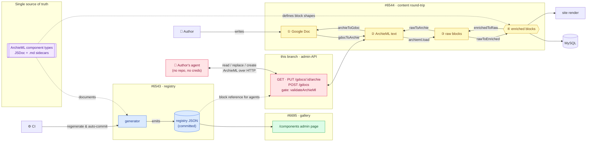
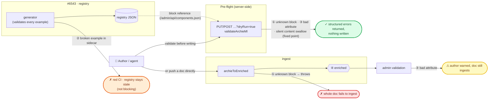
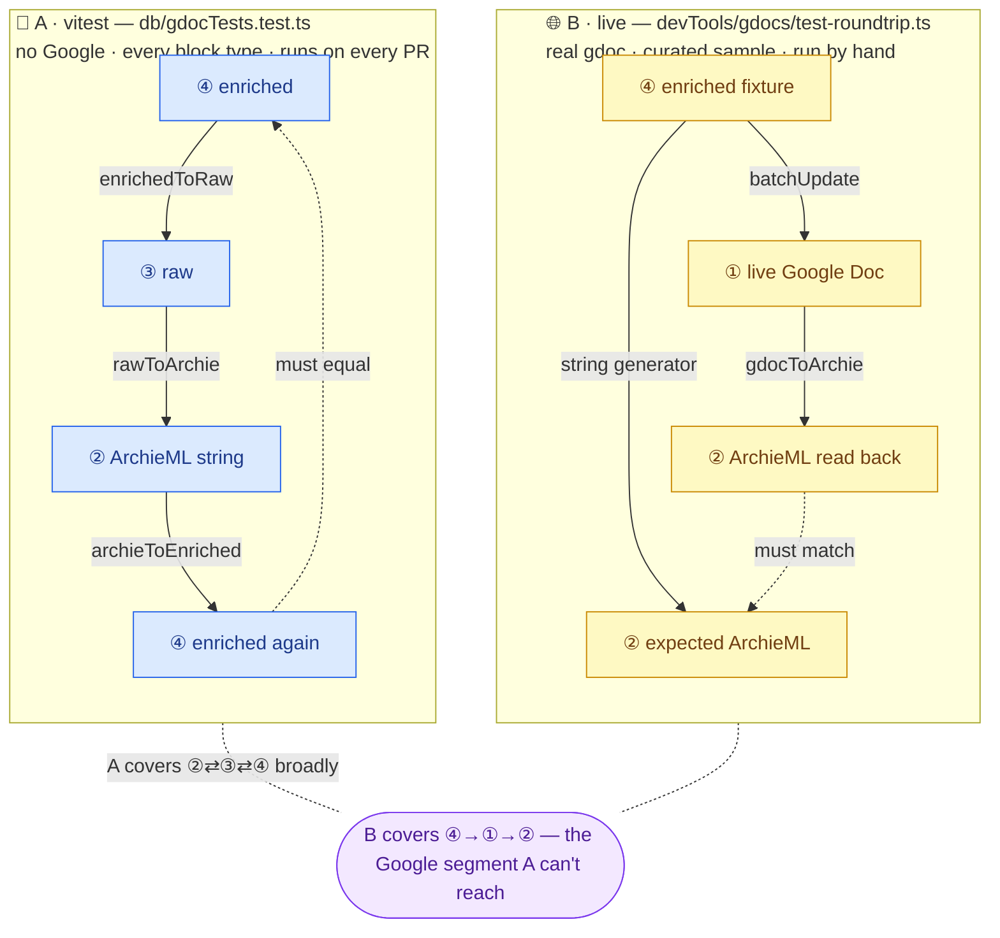

# Agent-editable gdocs CMS — visual overview

One idea across a stack of PRs: **the ArchieML component types are the single
source of truth**, and once every layer derives from them, an agent can safely
read, edit, and create gdocs on an author's behalf — with the server as the
only gate.

| PR / branch                                             | What it does                                                                                                                                                                                                                                                   |
| ------------------------------------------------------- | -------------------------------------------------------------------------------------------------------------------------------------------------------------------------------------------------------------------------------------------------------------- |
| [#6543](https://github.com/owid/owid-grapher/pull/6543) | Generates a JSON registry of all components from the type definitions (JSDoc + `.md` sidecars). CI keeps it fresh.                                                                                                                                             |
| [#6695](https://github.com/owid/owid-grapher/pull/6695) | Shows that registry in the admin at `/components` (and serves it at `/admin/api/components.json`).                                                                                                                                                             |
| [#6544](https://github.com/owid/owid-grapher/pull/6544) | Makes the gdoc ⇄ ArchieML round trip faithful (underline, strikethrough, refs) and tests it.                                                                                                                                                                   |
| this branch                                             | Exposes the round trip over HTTP: read/replace/create gdocs as ArchieML via the admin API, gated by `validateArchieMl`. A `gdoc-editor` skill in [owid-claude-plugins](https://github.com/owid/owid-claude-plugins) gives authors a repo-less Claude workflow. |

## The big picture

Content lives at **four levels**. Ingest walks down the ladder, write-back
walks up, and the admin API exposes level ② (the text authors and agents work
in) over HTTP. Colours = which PR owns the box.

Notes:

- `archieToEnriched` is the public entry point for ②→④ (it runs `archieml.load`
  then `rawToEnriched`, using `htmlToEnriched` for inline HTML). `archieToGdoc`
  is the entry point for ④→① (it calls `enrichedToRaw` then `rawToArchie`
  internally).
- Enriched (④) is what gets stored, validated, and rendered.

## When things go wrong

Same picture, with the failure paths. Colour = severity.

- **① Unknown block** (`{.small-chart}`): the parser throws and the _whole doc_
  fails. The dry-run endpoint returns the parser's error before anything is
  written; the block reference at `/admin/api/components.json` lists every valid
  block with docs and examples.
- **② Broken example** in a `.md` sidecar: the generator writes nothing and CI
  goes red. Not blocking — the committed registry just stays at its last good
  state until the example is fixed.
- **③ Bad attribute** on a known block: non-fatal `parseError`. The dry run
  reports it as a structured error; if the doc ingests anyway (direct push),
  the admin shows it to the author as a warning.
- **Silent content swallow**: ArchieML's `load()` never errors — a typo'd
  marker or unclosed `[.list]` silently drops content. `validateArchieMl`
  catches this with a fixed-point check (parse → write back → re-parse →
  compare).
- **Registry drift**: no failure at all — CI regenerates and auto-commits.

## CI self-heal

The registry JSON is generated, never hand-edited. On every push/PR **targeting
`master`**, the `regenerate-components-reference` job in
[`format.yml`](../.github/workflows/format.yml) reruns the generator and
auto-commits any diff. Broken examples make the job red and skip the commit, so
the committed registry can go stale but never corrupt.

**Stacked PRs:** only the bottom PR of a Graphite stack targets `master`, so
upstack PRs get no self-heal (and no auto-format). If you change types or
sidecars upstack, run `yarn generateComponentsReference` locally.

## How an agent edits a gdoc

A gdoc is not a text file: bold, links and refs are real Google formatting, not
markup characters. You can't "paste ArchieML into a doc" — something must
convert it, and the only converter (`articleToBatchUpdates`) takes **enriched**
input. The admin API is built around that funnel, so faulty ArchieML can't
reach the doc — there is no string-shaped door:

| Route                                 | What it does                                                                                                                                                                                                                                                                               |
| ------------------------------------- | ------------------------------------------------------------------------------------------------------------------------------------------------------------------------------------------------------------------------------------------------------------------------------------------ |
| `GET /admin/api/gdocs/:id/archie`     | The doc as canonical ArchieML text + `revisionId`, `registered`, `published`. Side-effect-free (unlike `?contentSource=gdocs`, which syncs images and persists).                                                                                                                           |
| `PUT /admin/api/gdocs/:id/archie`     | Wholesale-replace the doc content. Refuses published docs (403), unregistered docs (404), stale `expectedRevisionId` (409), and anything `validateArchieMl` rejects (400). `?dryRun=true` = validate only. After writing: read-back verification + re-ingest so the admin preview is warm. |
| `POST /admin/api/gdocs`               | Create a doc from ArchieML in a shared Drive folder (`folderId` or `GDOCS_AGENT_DRAFTS_FOLDER`), register it in the admin. Same gate and `?dryRun=true`.                                                                                                                                   |
| `GET /admin/api/gdocs/:id/validation` | The stored doc's complete validation report, exactly as the admin computes it (`getErrors`): `publishable`, `errors`, `warnings`.                                                                                                                                                          |

Validation reporting follows one rule — **each response is about exactly one
artifact, and the endpoint contract says which**. Dry runs and 400s judge
_your submission_ (`writable` + why not); `GET …/validation` and the write
success responses carry _the stored doc's_ complete report (`publishable` +
the admin's errors/warnings — errors block publishing, warnings never block
anything). No per-item taxonomy to decode.

The gate, [`validateArchieMl`](../db/model/Gdoc/validateArchieMl.ts), composes
the pipeline's own primitives: `archieToEnriched` (throws on unknown blocks) →
collect `parseErrors` → fixed-point re-serialize check → require a post-shaped
`type`. The round-trip test suite asserts through the same function, so CI
exercises exactly the gate the endpoints run.

Authors use this through the `gdoc-editor` skill in
[owid-claude-plugins](https://github.com/owid/owid-claude-plugins) — no repo
checkout, no Google credentials. On a tailnet machine, auth is automatic
(Tailscale identity); otherwise a Bearer admin API key works. The skill's
workflow: read (+ a `GET …/validation` baseline) → propose edits → dry run
until `writable` → show the author a diff → apply with `expectedRevisionId` →
report the saved doc's validation delta and the preview URL.

## The two round-trip tests

**A (vitest)** proves the converters are lossless for _every_ block type —
without touching Google. **B (live script)** proves the Google boundary is
lossless — for a small sample. Together they close the circle. Both A and the
API endpoints run through `validateArchieMl`, so the tested gate and the
production gate are the same function.

|          | A · vitest                 | B · live                     |
| -------- | -------------------------- | ---------------------------- |
| Path     | ④→③→②→④, in-process        | ④→①→②, through a real doc    |
| Coverage | every block example + refs | inline styles, heading, refs |
| Cost     | milliseconds, every PR     | creds + live doc, manual     |

B trusts A: its "expected" string comes from the same converters A already
proved lossless, so any diff B finds points at the Google segment. The `PUT`
endpoint runs B's read-back comparison on every real write, so each replaced
doc self-verifies.

Known gap: both loops start from machine-made content. Odd formatting in real
human docs is only caught at ingest, by admin validation.
