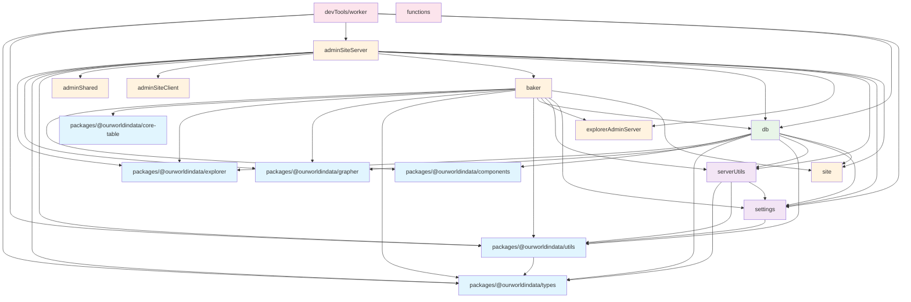

# TypeScript Project References and Import Structure

This document shows the TypeScript project reference structure based on the tsconfig.json files throughout the codebase.

## Project Structure Diagram

## Key Observations

### Circular Import Issues

The current structure shows several problematic patterns:

1. **devTools/worker → adminSiteServer**: The worker imports from adminSiteServer for R2 helpers and route utils
2. **devTools/worker → db**: Worker imports from db models
3. **db → [many modules]**: DB has many outbound references but should be more foundational
4. **adminSiteServer → [many modules]**: AdminSiteServer imports from many places including baker

### Root Cause Analysis

The circular import issue in our job queue implementation occurs because:

1. `devTools/worker` imports `adminSiteServer/R2/chartConfigR2Helpers.ts`
2. `devTools/worker` imports `adminSiteServer/apiRoutes/routeUtils.ts`
3. `db/model/Jobs.ts` tries to import `devTools/worker/explorerJobsWorker.ts`
4. But `db` TSConfig doesn't include `devTools/worker` in its references

### Recommended Solutions

1. **Move R2 helpers to shared location**: Move R2 helpers from `adminSiteServer` to `serverUtils` or create new `shared` module
2. **Extract shared utilities**: Move `triggerStaticBuild` to `serverUtils` or similar shared location
3. **Keep worker separate**: Don't import worker functions into `db` models - use dependency injection or separate entry points
4. **Dependency hierarchy**: Follow this order:
    - **Foundation**: `types` → `utils` → `settings` → `serverUtils`
    - **Core**: `db` (depends only on foundation + packages)
    - **Applications**: `adminSiteServer`, `baker`, etc. (can depend on core + foundation)
    - **Tools**: `devTools/*` (can depend on applications but shouldn't be imported by core)

## Current Structure Issues

- **db**: Should not depend on `site`, `components`, `explorer` - these should depend on db instead
- **worker**: Should not be imported by `db` models - creates circular dependency
- **adminSiteServer**: Has very broad dependencies - consider splitting into smaller modules

## Recommended Refactoring

1. Move shared utilities (R2, deploy queue) to `serverUtils` or new `shared` module
2. Make `db` more foundational - remove dependencies on higher-level modules
3. Use dependency injection for worker functionality instead of direct imports
4. Consider creating `@ourworldindata/shared` package for cross-cutting concerns
