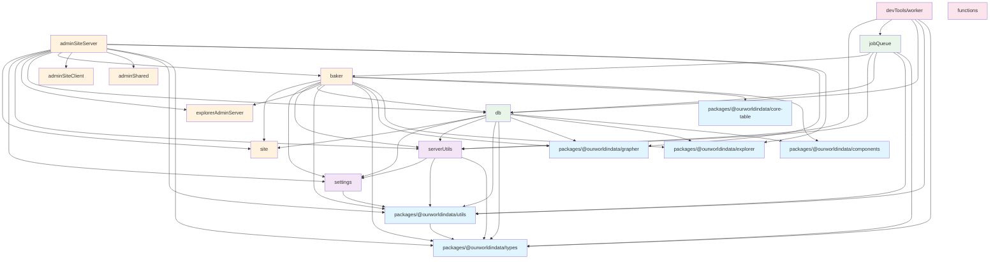

# TypeScript Project References and Import Structure

This document shows the TypeScript project reference structure based on the tsconfig.json files throughout the codebase.

## Project Structure Diagram

## Key Observations

### Circular Import Issues

The current structure shows several problematic patterns:

1. **devTools/worker → adminSiteServer**: The worker imports from adminSiteServer for R2 helpers and route utils
2. **devTools/worker → db**: Worker imports from db models
3. **db → [many modules]**: DB has many outbound references but should be more foundational
4. **adminSiteServer → [many modules]**: AdminSiteServer imports from many places including baker

### Recent Improvements

The circular import issues have been resolved through refactoring:

1. **R2 helpers moved**: `adminSiteServer/R2/*` helpers moved to `serverUtils/r2/*`
2. **Job queue extracted**: Created dedicated `jobQueue` module for job processing logic
3. **Worker separation**: `devTools/worker` now imports from `jobQueue` instead of mixing concerns
4. **Dependency inversion**: Worker calls job processor instead of db models calling worker functions

### Current Architecture

The current structure follows a cleaner dependency hierarchy:

1. **Foundation**: `types` → `utils` → `settings` → `serverUtils`
2. **Core**: `db` + `jobQueue` (depends only on foundation + packages)
3. **Applications**: `adminSiteServer`, `baker`, etc. (can depend on core + foundation)
4. **Tools**: `devTools/*` (can depend on applications and core but shouldn't be imported by core)

## Remaining Structure Issues

- **db**: Still depends on `site`, `components`, `explorer` - these should depend on db instead
- **adminSiteServer**: Has very broad dependencies - consider splitting into smaller modules

## Recent Completed Refactoring ✅

1. ✅ **Moved shared utilities**: R2 helpers moved from `adminSiteServer/R2/` to `serverUtils/r2/`
2. ✅ **Extracted job queue**: Created dedicated `jobQueue` module for processing logic
3. ✅ **Fixed circular imports**: Worker now uses dependency injection pattern instead of being imported by db models
4. ✅ **Cleaner separation**: Each module now has clearer responsibilities and dependencies
