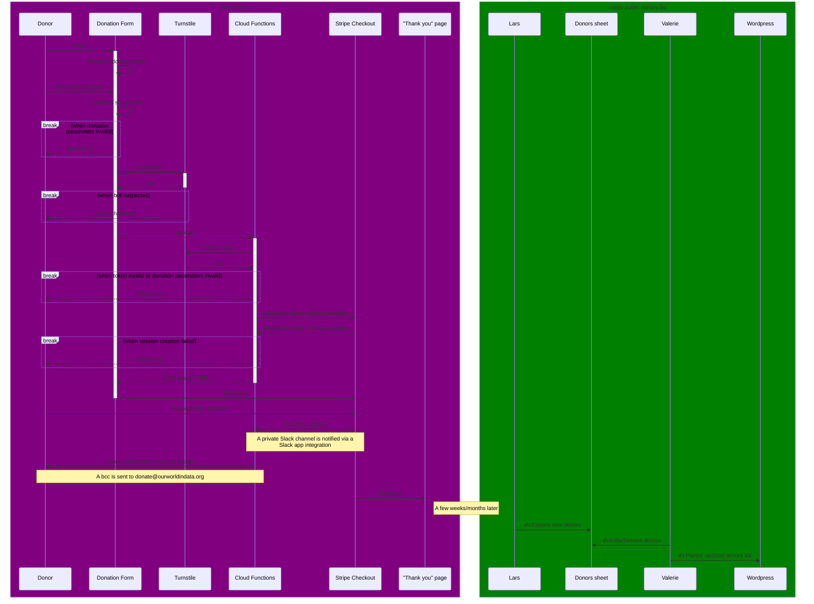

# Cloudflare Pages Functions

This directory contains code running in [Cloudflare Pages Functions](https://developers.cloudflare.com/pages/platform/functions/).
That is, the sites served on the paths where a function is defined are served dynamically, with our code running on Cloudflare's edge network.

Pages Functions are very similar to Cloudflare Workers; however they will always be kept in sync with the site, and they are also available in staging environments.

## File-based routing

Pages Functions use file-based routing, which means that the file `grapher/[slug].ts` will serve routes like `/grapher/child-mortality`.
In addition, there's a [`_routes.json`](../_routes.json) file that specifies which routes are to be served dynamically.

Inside a file-based route we sometimes use an instance of itty-router to decide on the exact functionality to provide (e.g. png vs svg generation)

## Development

1. Copy `.dev.vars.example` to `.dev.vars` and fill in the required variables.

2. Start the Cloudflare function development server with either:

- (preferred) `yarn make up.full`: starts the whole local development stack, including the functions development server
- `yarn startLocalCloudflareFunctions`: only starts the functions development server

Note: compatibility dates between local development, production and preview environments should be kept in sync:

- local: defined in `package.json` -> `startLocalCloudflareFunctions`
- production & preview : see https://dash.cloudflare.com/078fcdfed9955087315dd86792e71a7e/pages/view/owid/settings/functions

3. _Refer to each function's "Development" section below for further instructions._

## Testing on Foundation staging sites vs Cloudflare previews

We have two cloudflare projects set up that you can deploy previews to. `owid` which is also where our production deployment runs, and `owid-staging`. Currently, `owid` is configured to require authentication while `owid-staging` is accessible from the internet without any kind of auth.

To deploy to Cloudflare preview at https://[PREVIEW_BRANCH].[PROJECT].pages.dev run the following from `ops` repository

```bash
BUILDKITE_BRANCH=$PREVIEW_BRANCH bash templates/owid-site-staging/deploy-content-preview.sh $HOST
```

This is the recommended way to test functions in a production-like environment.

### Rationale

A custom staging site is available at http://staging-site-[BRANCH] upon pushing your branch (see ops > templates > lxc-manager > staging-create). This site is served by `wrangler` (see ops > templates > owid-site-staging > grapher-refresh.sh). `wrangler` is helpful for testing the functions locally (and possibly for some debugging scenarios on staging servers), but is still not the closest match to the production Cloudflare environment.

When it comes to testing functions in a production-like environment, Cloudflare previews are recommended.

Cloudflare previews are served by Cloudflare (as opposed to `wrangler` on staging sites) and are available at https://[RANDOM_ID].[PROJECT].pages.dev. Cloudflare previews do not rely on the `wrangler` CLI and its `.dev.vars` file, but they do take the `wrangler.toml` file into account for environment variables. For secrets, they use the [values set via the Cloudflare dashboard](https://dash.cloudflare.com/078fcdfed9955087315dd86792e71a7e/pages/view/owid/settings/environment-variables), in the same way and place as the production site.

This proximity of configurations in the Cloudflare dashboard makes spotting differences between production and preview environments easier - and is one of the reason of using Cloudflare previews in the same project (owid) over using a new project specific to staging.

Our workflow uses `wrangler pages deploy` to deploy the `bakedSite` to
Cloudflare. Similarly, `yarn deployContentPreview` uses `wrangler pages deploy
--branch=[PREVIEW_BRANCH]` to deploy the `bakedSite` to a Cloudflare preview at
https://[PREVIEW_BRANCH].owid-staging.pages.dev.

# Analytics

Download requests are tracked via Google Analytics 4 using a middleware system. The analytics functionality is centralized in `_common/analytics.ts`.

## How it works

The analytics system operates through a middleware that runs for every request:

1. **Middleware execution**: The `analyticsMiddleware` function runs before all route handlers via `_middleware.ts`
2. **Download detection**: For download requests (based on file extensions), the middleware:
    - Applies sampling based on `CLOUDFLARE_GOOGLE_ANALYTICS_SAMPLING_RATE`
    - Processes the request to capture the response status code
    - Sends analytics data to Google Analytics 4 using `context.waitUntil()` for non-blocking execution

## Configuration

The analytics system requires these environment variables:

- `CLOUDFLARE_GOOGLE_ANALYTICS_MEASUREMENT_PROTOCOL_KEY`
    - A secret API key to authorize requests to the measurement protocol endpoint.
    - Found in Google Analytics under "Measurement Protocol API secrets"
    - e.g. "Jh0bas87b12Ebhjas927ba"
- `CLOUDFLARE_GOOGLE_ANALYTICS_MEASUREMENT_ID`:
    - An ID that links this measurement protocol to our GA4 setup.
    - Found in Google Analytics under "Web stream details"
    - e.g. "A1B2C3D4E5"
- `CLOUDFLARE_GOOGLE_ANALYTICS_SAMPLING_RATE`
    - Sampling rate as decimal
    - e.g. "0.01" for 1%

## Performance considerations

- **Non-blocking**: Analytics requests use `context.waitUntil()` so they don't delay user responses
- **Sampling**: Only a percentage of requests are tracked (configurable via environment variable)
- **Error handling**: Analytics failures are logged but don't affect user experience

# Our dynamic routes

## `/api/detect-country`

This route detects the visitor's country using Cloudflare's `cf.country` property (derived from the request's IP address) and returns structured country information.

This was previously handled by a separate service at `detect-country.owid.io` and has been moved in-house to reduce external dependencies.

### Response

The response is a JSON object with a single `country` key, which is either `null` (if the country could not be detected or is not in our regions dataset) or an object with the following fields:

| Field        | Type             | Description                            |
| ------------ | ---------------- | -------------------------------------- |
| `code`       | string           | OWID region code (e.g. `"DEU"`)        |
| `name`       | string           | Country name (e.g. `"Germany"`)        |
| `short_code` | string           | ISO 3166-1 alpha-2 code (e.g. `"DE"`)  |
| `slug`       | string           | URL slug (e.g. `"germany"`)            |
| `regions`    | string[] \| null | Parent region codes, or `null` if none |

### Headers

- `Access-Control-Allow-Origin: *` — accessible from any origin
- `Cache-Control: public, s-maxage=0, max-age=7200` — cached in the browser for 2 hours, not cached on the CDN edge

### Example

```
GET /api/detect-country

200 OK
{
  "country": {
    "code": "DEU",
    "name": "Germany",
    "short_code": "DE",
    "slug": "germany",
    "regions": [
      "OWID_EU27",
      "OWID_EUR",
      "OWID_HIC",
      "OWID_NH",
      "PEW_EUR",
      "UNM49_EUR",
      "UNM49_WEU",
      "UNSDG_ENA",
      "UN_EUR",
      "WB_ECA",
      "WHO_EUR"
    ]
  }
}
```

## `/api/search`

This route provides a search API for both charts and pages (articles, about pages).

For detailed API documentation, including all parameters, response schemas, and examples, see [search-api.openapi.yaml](../docs/search-api.openapi.yaml).

## `/api/email-notifications/subscribe`

Handles submissions of the email notifications subscribe form on `/subscribe`
(prototype). The request body is validated against
`EmailNotificationsSubscribeRequestTypeObject` from `@ourworldindata/types`,
which is shared with the client.

It does two things, depending on the request:

1. If the request contains `notifications` preferences (topic tags, content
   types, frequency), it stores them as **pending** in the
   `EMAIL_NOTIFICATIONS_DB` D1 database: the user is created in the `pending`
   state if new (an existing user's status and preferences are never touched
   here), the chosen preferences are held on a single-use, expiring confirm
   token (`tokens` table), and a confirmation email is sent via Postmark.
   Every submission takes this same path regardless of the email's current
   state — nothing changes until the confirm link is acted on, so no
   preference change or (re)subscription ever happens without proof of inbox
   control, and the response is identical whether the email was already
   known or not. Only the email copy differs (new subscription / preference
   change / re-subscription). When the `POSTMARK_SERVER_TOKEN` environment
   variable is not set, sending is skipped with a console warning that
   includes the confirm URL, so the flow can be tested locally without
   Postmark credentials. To inspect outgoing emails locally (and click the
   links they contain), run `yarn postmarkCatcher` and set
   `POSTMARK_API_BASE_URL=http://localhost:8025` in `.dev.vars` along with
   any `POSTMARK_SERVER_TOKEN` value.
2. If the request has `subscribeToOwidBrief: true`, it upserts the Mailchimp
   newsletter list member with the OWID Brief interest (group) checked. The
   OWID Brief newsletter stays in Mailchimp. New Mailchimp list members are
   created with `status_if_new: "pending"`, so Mailchimp sends them its own
   double-opt-in confirmation email. The call is skipped (with a console
   warning) when the `MAILCHIMP_API_KEY`, `MAILCHIMP_API_SERVER` or
   `MAILCHIMP_NEWSLETTER_LIST_ID` environment variables are not set, so the
   rest of the flow can be tested locally without Mailchimp credentials.

## `/api/email-notifications/confirm`

Confirm link target from the confirmation emails, with a `token` query
parameter (a `confirm`-purpose row in the `tokens` table). GET only renders a
page — mail security scanners prefetch links in emails, so state must never
change on GET. The page's button POSTs the token back to the same route,
which consumes it and applies the preferences it carries: a new user becomes
`subscribed`, an existing user's preferences are replaced, an unsubscribed
user is reactivated. Expired tokens render a page whose button POSTs to
`resend-confirmation`; consumed tokens render an "already confirmed" page.

## `/api/email-notifications/resend-confirmation`

POST target of the expired-confirmation page's resend button. Takes the
expired confirm token (form field `token`), issues a fresh token carrying the
same pending preferences, and re-sends the confirmation email. Safe to expose
for expired tokens: the only thing an expired token can do is cause an email
to be sent to its own address.

## `/api/email-notifications/request-link`

Requests a magic link for viewing/updating preferences. GET with a `token`
query parameter (the permanent per-user token, from the "update your
preferences" link in email footers) renders an "Email me a link" page whose
button POSTs back — the in-email token can only _request_ a link; editing
preferences requires proving control of the inbox right now via the
short-lived link (Mailchimp's pattern). POST accepts either a form `token`
(responds with a "Check your inbox" page) or JSON `{ email }` / `{ token }`
from the preferences page (responds with JSON). **Unknown emails get the
identical response and no email is sent** — a courtesy "you're not
subscribed" email would turn the endpoint into a tool for mailing arbitrary
addresses. Expired magic-link tokens are accepted (their resend button):
their only remaining power is causing an email to their own address.

## `/api/email-notifications/preferences`

Data source and save target of the magic-link preferences page
(`/subscribe/preferences`, token in the URL fragment). GET with a `token`
query parameter (a valid magic-link token) returns the user's email and
current preferences as JSON; 410 for expired tokens drives the page's
expired state. POST with JSON `{ token, preferences }` applies changes
immediately — the magic link itself was the proof of inbox control, so
there is no second confirmation (this also reactivates an unsubscribed
user); `{ token, unsubscribe: true }` unsubscribes. An optional
`subscribeToOwidBrief` updates the Mailchimp Brief interest **fail-soft**: a
Mailchimp failure never blocks the D1 save.

## `/api/email-notifications/brief-status`

Whether the magic-link token's user is subscribed to the OWID Brief in
Mailchimp. Powers the preferences page's fail-soft Brief toggle: any non-200
(invalid/expired token, Mailchimp unavailable or unconfigured) makes the
page hide the toggle.

## `/api/email-notifications/unsubscribe`

Link target from the notification email footers, with a `token` query
parameter — the per-user permanent secret stored in the `users` table. GET
renders a confirm page (no state change, same scanner rule as above) whose
button POSTs back to the same route, which sets the user's status to
`unsubscribed`. The POST route is also the target of the
`List-Unsubscribe-Post` one-click unsubscribe header: email clients POST
directly to it with the token in the query string and no page shown.

## Sending the notification emails

The actual notification emails are sent by `yarn sendEmailNotifications
<daily|weekly>`, a cron job that runs on our own infra (not on Cloudflare) —
see `baker/emailNotifications/sendEmailNotifications.ts`. It reads
subscribers from the D1 database remotely via the Cloudflare HTTP API,
collects the latest-feed content (articles, data insights, announcements)
published since each subscriber's last email from MySQL, renders the
hardcoded email template, sends via Postmark, and records the send back to
D1 (`notification_preferences.last_sent_at` + a `sent_emails` row).

Useful flags for local development:

- `--local` reads/writes the local wrangler D1 database (the same one the
  functions dev server uses) instead of the remote one.
- `--dry-run` renders the emails to `.email-notifications-preview/` instead
  of sending them.

### D1 database

The D1 database is configured in `wrangler.jsonc` (binding
`EMAIL_NOTIFICATIONS_DB`), with migrations in
`d1/email-notifications/migrations`.

For local development, create and migrate the local database with:

```bash
npx wrangler d1 migrations apply owid-email-notifications-staging --local
```

The staging and production databases don't exist yet. Before deploying, create
them with `npx wrangler d1 create owid-email-notifications-staging` (and
`owid-email-notifications` for production), fill in the real `database_id`
values in `wrangler.jsonc`, and apply the migrations with `--remote`.

### Rate limiting

Cloudflare's [rate limiting binding](https://developers.cloudflare.com/workers/runtime-apis/bindings/rate-limit/)
is only available to Workers, not Pages, so until we migrate to Workers this
public API needs to be rate limited with a zone-level WAF rate limiting rule
(Cloudflare dashboard → Security → WAF → Rate limiting rules) on
`/api/email-notifications/*`. The function already honors an optional
`EMAIL_NOTIFICATIONS_RATE_LIMITER` binding so that it keeps working after the
migration.

### Development

The subscribe form on `http://localhost:3030/subscribe` posts to
`http://localhost:8788/api/email-notifications/subscribe` by default (see
`EMAIL_NOTIFICATIONS_API_BASE_URL` in `settings/clientSettings.ts`), so run the
functions dev server alongside the site:

```bash
yarn startLocalCloudflareFunctions
```

Inspect the stored subscriptions with:

```bash
npx wrangler d1 execute owid-email-notifications-staging --local \
    --command "SELECT * FROM users JOIN notification_preferences ON notification_preferences.user_id = users.id"
```

## `/deleted/:slug`

This route is used to handle deleted pages. They are fully baked we just want them to return a 404 status code instead of a 200.

## `/donation/donate`

This route is used to create a Stripe Checkout session for a donation.

When a user clicks the Donate button on our donate page, they send a request to this function, which verifies that they've passed the CAPTCHA challenge and validates their donation parameters (amount, interval, etc.).

If all goes well, this function will respond with the URL of a Stripe Checkout form, where the donor's browser will be redirected to. From there, Stripe deals with the donation – collecting card & address info. Stripe has success and cancel URLs configured to redirect users after completion.


```mermaid
sequenceDiagram
    box Purple Donor flow
    participant Donor
    participant Donation Form
    participant Turnstile
    participant Cloud Functions
    participant Stripe Checkout
    participant "Thank you" page
    end
    box Green Udate public donors list
    participant Lars
    participant Donors sheet
    participant Valerie
    participant Wordpress
    end
    Donor ->>+ Donation Form: Visits
    Donation Form ->> Donation Form: Activates donate button
    Donor ->> Donation Form: Fills in and submits
    Donation Form ->> Donation Form: Validates submission
    break when donation parameters invalid
    Donation Form -->> Donor: Show error
    end
    Donation Form ->>+ Turnstile: is human?
    Turnstile -->>- Donation Form: yes
    break when bot suspected
    Turnstile -->> Donor: show challenge
    end
    Donation Form ->>+ Cloud Functions: submits
    Cloud Functions ->> Turnstile: is token valid?
    Turnstile -->> Cloud Functions: yes
    break when token invalid or donation parameters invalid
    Cloud Functions -->> Donor: Show error
    end
    Cloud Functions ->> Stripe Checkout: Requests Stripe checkout session
    Stripe Checkout -->> Cloud Functions: Generates Stripe checkout session
    break when session creation failed
    Cloud Functions -->> Donor: Show error
    end
    Cloud Functions -->>- Donation Form: Send session URL
    Donation Form ->>- Stripe Checkout: Redirects
    Donor ->> Stripe Checkout: Proceeds with payment
    Stripe Checkout -->> Cloud Functions: Confirms payment
    Note over Cloud Functions, Stripe Checkout: A private Slack channel is notified via a <br>Slack app integration
    Cloud Functions ->> Donor: Sends confirmation email via Mailgun
    Note over Donor, Cloud Functions: A bcc is sent to donate@ourworldindata.org
    Stripe Checkout ->> "Thank you" page: Redirects
    Note right of "Thank you" page: A few weeks/months later
    Lars ->> Donors sheet: ✍️ Exports new donors
    Valerie ->> Donors sheet: ✍️  Edits/Deletes donors
    Valerie ->> Wordpress: ✍️  Pastes updated donors list
```

### Development

0. _Follow steps 1 and 2 in the "Development" section to start the functions development server._

The route is available locally at `http://localhost:8788/donation/donate`.

1. Go to `http://localhost:3030/donate` and fill in the form. You should be redirected to a Stripe Checkout page. You should use the Stripe VISA test card saved in 1Password (or any other test payment method from https://stripe.com/docs/testing) to complete the donation. Do not use a real card.

## `/donation/thank-you`

This route is used to handle incoming Stripe webhook `checkout.session.completed` events.

This webhook event is fired by Stripe when a user completes a donation on the Stripe checkout page.

This webhook is registered for production in the Stripe dashboard, at https://dashboard.stripe.com/webhooks. For local development, the webhook is registered using the Stripe CLI (see below).

### Stripe

In order to test the webhook function locally, you can use the Stripe CLI to listen to incoming events and forward them to your functions development server.

0. _Follow steps 1 and 2 in the "Development" section to start the functions development server._

1. Install Stripe CLI:
   https://stripe.com/docs/stripe-cli#install

2. Register a temporary webhook using the Stripe CLI (runs in test mode by default):

```sh
STRIPE_API_KEY=xxx stripe listen --latest --forward-to localhost:8788/donation/thank-you
```

- replace `xxx` with the value of `STRIPE_API_KEY (dev)` in 1password. Alternatively, if you have access to the Stripe dashboard, you can forgo the `STRIPE_API_KEY=xxx` part and let `stripe listen ...` guide you through a one-time login process.
- `--latest` is required when development code uses a more recent API version than the one set in the Stripe dashboard (which `stripe listen` will default to).

3. Copy the webhook secret into `STRIPE_WEBHOOK_SECRET` variable in your `.dev.vars` and then restart the development server. This secret is shown when you ran `stripe listen`, and is stable across restarts.

4. Make a test donation through http://localhost:3030/donate. You should see the event logged in the terminal where you ran `stripe listen`.

Alternatively, you can trigger a test event from the CLI.

```sh
stripe trigger checkout.session.completed
```

Note: this will send the `checkout.session.completed` event expected in `/donation/thank-you`. However, I didn't manage to add metadata with `--add checkout.session:metadata.name="John Doe" --add checkout.session:metadata.showOnList=true` to perform a full test.

### Mailchimp

The thank-you webhook can subscribe donors to a Mailchimp newsletter list. To test this functionality:

1. Set up the following environment variables in your `.dev.vars`:
    - `MAILCHIMP_API_KEY`: You can find this in 1Password.
    - `MAILCHIMP_API_SERVER`: The server prefix for our Mailchimp account (e.g., "us1"). You can find this in the URL when you log into Mailchimp (e.g., `https://us1.admin.mailchimp.com`).
    - `MAILCHIMP_DONOR_LIST_ID`: The ID of the donor newsletter Mailchimp list you want to subscribe donors to. You can find this in 1Password.

2. Run the Stripe client as described in the preceding section.

3. When testing a donation, make sure to check the "Subscribe to donor newsletter" option on the donation form.

4. After completing the donation, check the Mailchimp list to verify that the donor was subscribed successfully.

Note: The integration uses Mailchimp's MD5 hash of the subscriber's email address as the unique identifier. If a subscriber already exists in the list, their status will be updated to "subscribed" if they were previously unsubscribed.

### Testing on Cloudflare previews

The webhook registered in the Stripe dashboard is configured to send test events to https://donate.owid.pages.dev/donation/thank-you.

There is however a [Cloudflare Access rule restricting access to \*.owid.pages.dev](https://one.dash.cloudflare.com/078fcdfed9955087315dd86792e71a7e/access/apps/edit/d8c658c3-fd20-477e-ac20-e7ed7fd656de?tab=overview), so the Stripe webhook invocation will hit the Google Auth page instead of the function. To test the webhook on a Cloudflare preview, you need to temporarily disable the Cloudflare Access rule (the easiest is to change the rule to an unused subdomain, e.g. `temp.owid.pages.dev`).

## `/grapher/:slug`

Our grapher pages are (slightly) dynamic!
They're still driven by a statically rendered page, but to make dynamic thumbnails work, we need to inject the query params into the `<meta property="og:image">` [^1] and `<meta property="twitter:image">` [^2] tags.

So, for example, if a request is coming in for `/grapher/population?tab=chart&time=1999..2023`, then we need to reflect these query params in the tags for social media preview images, too, and would put something like `<meta property="og:image" content="/grapher/thumbnail/population?tab=chart&time=1999..2023>` so that social media posts will then show the preview for the exact chart configuration.

For detailed API documentation, including all parameters, response schemas, and examples, see [chart-api.openapi.yaml](../docs/chart-api.openapi.yaml).

## `/grapher/thumbnail/:slug`

This route is where the actual thumbnail magic happens 🙌🏻✨

It can:

- Generate _png_ and _svg_ previews
- Render _png_ exports using our custom fonts, Lato and Playfair
- Render a preview according to all its query parameters
- Customize the image output a bunch using various options (see below)

We (plan to) use these for social media previews, such that the social media user will see the exact chart that is shared, for example with a `?tab=chart&country=IND~CHN&time=2000`.
We cannot possibly create static previews for all possible combinations, but we can generate them dynamically on the fly as they are being shared.

### How it works

When a request to `/grapher/thumbnail/:slug` comes in, the following steps are performed:

1. Fetch the grapher page `/grapher/:slug` and extract the grapher config using the `// EMBEDDED_JSON` trickery.
2. Instantiate the grapher (the whole `@ourworldindata/grapher` module is bundled together with the worker).
3. Let grapher fetch its data files.
4. (Optional) If the grapher config references Details on Demand and DoDs are to be rendered, additionally fetch https://ourworldindata.org/dods.json.
5. Render to static svg.

#### Conversion to png

If the output file is supposed to be a _png_ file, then we additionally convert it:

We use [svg2png-wasm](https://github.com/ssssota/svg2png-wasm/tree/main) for conversion to png, which is a WebAssembly tool written in Rust that then uses [resvg](https://crates.io/crates/resvg) for the actual conversion.
Crucially, and unlike [resvg-wasm](https://www.npmjs.com/package/@resvg/resvg-wasm) at the time of writing, `svg2png-wasm` also supports text rendering using custom fonts!

You can find these fonts in the `fonts/` directory here; note however that these need to be TrueType (ttf) fonts. The font files are also packed into the bundle and are as such locally available in the deployed Cloudflare Worker.

### Options

All of the below options can be given as query parameters, e.g. `?imType=og&nocache`.

<table>
  <tr>
    <th>Option name</th>
    <th>Valid values / types</th>
    <th>Description</th>
  </tr>
  <tr>
    <td><code>nocache</code></td>
    <td>
      Assumed to be true whenever present in any way, even just
      <code>&nocache</code>
      works.
    </td>
    <td>
      When present, will not read or write from/to the Cloudflare cache, and return a
      <code>Cache-Control: max-age=0</code> header.
      <tr>
        <td><code>imType</code></td>
        <td>
          <code>twitter</code> or <code>og</code> (short for
          <a href="https://ogp.me">Open Graph</a>)
        </td>
        <td>
          If present, will use fitting defaults for the generated image size:
          <ul>
            <li><code>twitter</code>: 800x418</li>
            <li><code>og</code>: 1200x628</li>
          </ul>
          All below options will be ignored if <code>imType</code> is set to one of these values.
        </td>
      </tr>
      <tr>
        <td><code>imWidth</code></td>
        <td>number</td>
        <td rowspan="2">
          The width/height of the png image to be rendered. <br />For technical reasons, the
          <code>viewbox</code> of the returned svg might be different. <br />
          If only one these values is provided, the other one is filled in according to a default
          aspect ratio.<br /><br />
          If Details on Demand are to be included in the footer (<code>imDetails</code>) then the
          total height may be higher, because the height only measures the chart frame itself.
        </td>
      </tr>
      <tr>
        <td><code>imHeight</code></td>
        <td>number</td>
      </tr>
      <tr>
        <td><code>imDetails</code></td>
        <td><code>1</code></td>
        <td>
          Whether the footer should list definitions of all Details on Demand included in the chart.
        </td>
      </tr>
    </td>
  </tr>
</table>

In addition, all grapher URL options can be included as query parameters, e.g. `?time=1850..latest&tab=map&region=Asia`.

[^1]: For OpenGraph; this one is being used by Facebook, LinkedIn, Slack, WhatsApp, Signal, etc.

[^2]: For Twitter.
