# Cloudflare Pages Functions

This directory contains code running in [Cloudflare Pages Functions](https://developers.cloudflare.com/pages/platform/functions/).
That is, the sites served on the paths where a function is defined are served dynamically, with our code running on Cloudflare's edge network.

Pages Functions are very similar to Cloudflare Workers; however they will always be kept in sync with the site, and they are also available in staging environments.

## File-based routing

Pages Functions uses file-based, which means that the file `grapher/[slug].ts` will serve routes like `/grapher/child-mortality`.
In addition, there's a [`_routes.json`](../_routes.json) file that specifies which routes are to be served dynamically.

# Our dynamic routes

## `/donate/donate`

This route is used to create a Stripe Checkout session for a donation.

When a user clicks the Donate button on our donate page, they send a request to this function, which verifies that they've passed the CAPTCHA challenge and validates their donation parameters (amount, interval, etc.).

If all goes well, this function will respond with the URL of a Stripe Checkout form, where the donor's browser will be redirected to. From there, Stripe deals with the donation – collecting card & address info. Stripe has success and cancel URLs configured to redirect users after completion.

```mermaid
sequenceDiagram
    box Purple Donor flow
    participant Donor
    participant Donation Form
    participant Recaptcha
    participant Cloud Functions
    participant Stripe Checkout
    participant "Thank you" page
    end
    box Green Udate public donors list
    participant Lars
    participant Donors sheet
    participant Valerie
    participant Wordpress
    end
    Donor ->>+ Donation Form: Visits
    Donation Form ->> Donation Form: Activates donate button
    Donor ->> Donation Form: Fills in and submits
    Donation Form ->> Donation Form: Validates submission
    break when donation parameters invalid
    Donation Form -->> Donor: Show error
    end
    Donation Form ->>+ Recaptcha: is human?
    Recaptcha -->>- Donation Form: yes
    break when bot suspected
    Recaptcha -->> Donor: show challenge
    end
    Donation Form ->>+ Cloud Functions: submits
    Cloud Functions ->> Recaptcha: is token valid?
    Recaptcha -->> Cloud Functions: yes
    break when token invalid or donation parameters invalid
    Cloud Functions -->> Donor: Show error
    end
    Cloud Functions ->> Stripe Checkout: Requests Stripe checkout session
    Stripe Checkout -->> Cloud Functions: Generates Stripe checkout session
    break when session creation failed
    Cloud Functions -->> Donor: Show error
    end
    Cloud Functions -->>- Donation Form: Send session URL
    Donation Form ->>- Stripe Checkout: Redirects
    Donor ->> Stripe Checkout: Proceeds with payment
    Stripe Checkout -->> Cloud Functions: Confirms payment
    Cloud Functions ->> Donor: Sends confirmation email via Mailgun
    Stripe Checkout ->> "Thank you" page: Redirects
    Note right of "Thank you" page: A few weeks/months later
    Lars ->> Donors sheet: ✍️ Exports new donors
    Valerie ->> Donors sheet: ✍️  Edits/Deletes donors
    Valerie ->> Wordpress: ✍️  Pastes updated donors list
```

### Development

Start the Cloudflare function development server with either:

-   (preferred) `yarn make up.full`: starts the whole local development stack, including the functions development server
-   `yarn startLocalCloudflareFunctions`: only starts the functions development server

The route is available at `http://localhost:8788/donate/donate`.

Note: compatibility dates between local development and production environments should be kept in sync:

-   local: defined in `package.json` -> `startLocalCloudflareFunctions`
-   production: see https://dash.cloudflare.com/078fcdfed9955087315dd86792e71a7e/pages/view/owid/settings/functions

## `/grapher/:slug`

Our grapher pages are (slightly) dynamic!
They're still driven by a statically rendered page, but to make dynamic thumbnails work, we need to inject the query params into the `<meta property="og:image">` [^1] and `<meta property="twitter:image">` [^2] tags.

So, for example, if a request is coming in for `/grapher/population?tab=chart&time=1999..2023`, then we need to reflect these query params in the tags for social media preview images, too, and would put something like `<meta property="og:image" content="/grapher/thumbnail/population?tab=chart&time=1999..2023>` so that social media posts will then show the preview for the exact chart configuration.

## `/grapher/thumbnail/:slug`

This route is where the actual thumbnail magic happens 🙌🏻✨

It can:

-   Generate _png_ and _svg_ previews
-   Render _png_ exports using our custom fonts, Lato and Playfair
-   Render a preview according to all its query parameters
-   Customize the image output a bunch using various options (see below)

We (plan to) use these for social media previews, such that the social media user will see the exact chart that is shared, for example with a `?tab=chart&country=IND~CHN&time=2000`.
We cannot possibly create static previews for all possible combinations, but we can generate them dynamically on the fly as they are being shared.

### How it works

When a request to `/grapher/thumbnail/:slug` comes in, the following steps are performed:

1. Fetch the grapher page `/grapher/:slug` and extract the grapher config using the `// EMBEDDED_JSON` trickery.
2. Instantiate the grapher (the whole `@ourworldindata/grapher` module is bundled together with the worker).
3. Let grapher fetch its data files.
4. (Optional) If the grapher config references Details on Demand and DoDs are to be rendered, additionally fetch https://ourworldindata.org/dods.json.
5. Render to static svg.

#### Conversion to png

If the output file is supposed to be a _png_ file, then we additionally convert it:

We use [svg2png-wasm](https://github.com/ssssota/svg2png-wasm/tree/main) for conversion to png, which is a WebAssembly tool written in Rust that then uses [resvg](https://crates.io/crates/resvg) for the actual conversion.
Crucially, and unlike [resvg-wasm](https://www.npmjs.com/package/@resvg/resvg-wasm) at the time of writing, `svg2png-wasm` also supports text rendering using custom fonts!

You can find these fonts in the `fonts/` directory here; note however that these need to be TrueType (ttf) fonts. The font files are also packed into the bundle and are as such locally available in the deployed Cloudflare Worker.

### Options

All of the below options can be given as query parameters, e.g. `?imType=og&nocache`.

<table>
  <tr>
    <th>Option name</th>
    <th>Valid values / types</th>
    <th>Description</th>
  </tr>
  <tr>
    <td><code>nocache</code></td>
    <td>
      Assumed to be true whenever present in any way, even just
      <code>&nocache</code>
      works.
    </td>
    <td>
      When present, will not read or write from/to the Cloudflare cache, and return a
      <code>Cache-Control: max-age=0</code> header.
      <tr>
        <td><code>imType</code></td>
        <td>
          <code>twitter</code> or <code>og</code> (short for
          <a href="https://ogp.me">Open Graph</a>)
        </td>
        <td>
          If present, will use fitting defaults for the generated image size:
          <ul>
            <li><code>twitter</code>: 800x418</li>
            <li><code>og</code>: 1200x628</li>
          </ul>
          All below options will be ignored if <code>imType</code> is set to one of these values.
        </td>
      </tr>
      <tr>
        <td><code>imWidth</code></td>
        <td>number</td>
        <td rowspan="2">
          The width/height of the png image to be rendered.  For technical reasons, the
          <code>viewbox</code> of the returned svg might be different.  
          If only one these values is provided, the other one is filled in according to a default
          aspect ratio.  
          If Details on Demand are to be included in the footer (<code>imDetails</code>) then the
          total height may be higher, because the height only measures the chart frame itself.
        </td>
      </tr>
      <tr>
        <td><code>imHeight</code></td>
        <td>number</td>
      </tr>
      <tr>
        <td><code>imDetails</code></td>
        <td><code>1</code></td>
        <td>
          Whether the footer should list definitions of all Details on Demand included in the chart.
        </td>
      </tr>
    </td>
  </tr>
</table>

In addition, all grapher URL options can be included as query parameters, e.g. `?time=1850..latest&tab=map&region=Asia`.

[^1]: For OpenGraph; this one is being used by Facebook, LinkedIn, Slack, WhatsApp, Signal, etc.
[^2]: For Twitter.
