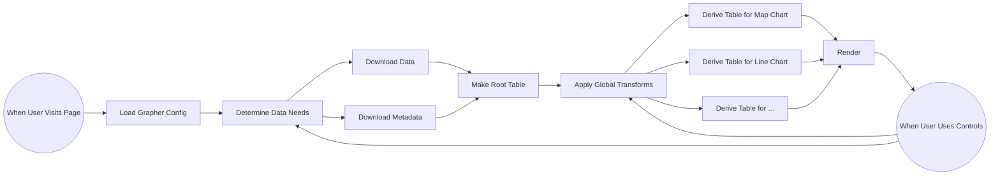

# Grapher

This folder contains the code for Grapher, our client side data exploration and visualization library. The Grapher pipeline is explained below.

## Step 1: The Grapher Config

The user navigates to a grapher page and the browser fetches the **Grapher Config**.

The _Grapher Config_ contains 3 main ingredients:

-   Where to get the **Data** and **Metadata**
-   Any **Transforms** to apply to the data
-   What **Chart Components** to show

## Step 2: The Data

Once the **Grapher Library** has parsed the _Grapher Config_, it fetches the _Data_ from the URLs in that config (or in some cases the _Data_ is embedded right in the _Grapher Config_).

The _Data_ is downloaded in two pieces (though technically the second piece is optional):

1. The _Data_ in CSV (or TSV, JSON, etc). For example:

```
Country,GDP,Year
Iceland,123,2020
France,456,2020
...
```

2. The _Metadata_ about the **Columns** in the _Data_ (including source information). For example:

```
Column,Name,Source
GDP,Gross Domestic Product,World Bank
...
```

Then Grapher's **Table Library** parsed the _Data_ into memory as a **Table**. This _Table_ has **Rows** and _Columns_.

The initial _Table_ is called the **Root Table**.

## Step 3: Global Transforms

If the _Grapher Config_ specified any _Transforms_ such as filtering or grouping, the _Table Library_ will apply those.

For example, if a "Min Year Transform" is specified, rows earlier than that year will be filtered.

## Step 4: Child Tables

The _Grapher Library_ then derives one **Child Table** for each _Chart Component_ from the _Root Table_.

If the author specified different _Transforms_ for different _Chart Components_—i.e. a different year to show on the Map Component—those are applied.

All _Chart Components_ can now also make any changes they want to their _Child Table_ without affecting other _Chart Components_. If _Transforms_ are
made to the "Root Table", those changes automatically propagate down to all _Child Tables_.

## Step 5: Rendering

Now all the _Chart Components_ have all their own _Tables_ and Grapher renders to the user's screen.

As the user interacts with **Chart Controls**, changes are made to the respective _Tables_ and the visualizations update.

### Flowchart



