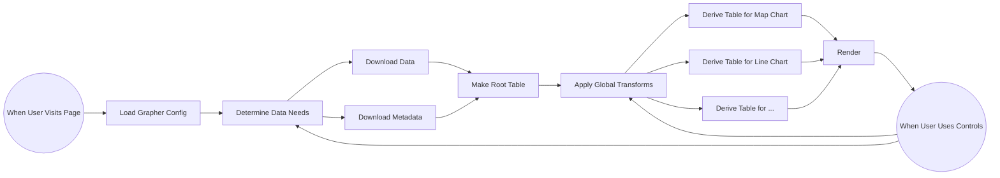

# How Grapher works

The Grapher pipeline, as it runs on ourworldindata.org.

## Step 1: The Grapher config

The user navigates to a grapher page and the browser fetches the **Grapher config**. It contains three main ingredients:

- Where to get the **data** and **metadata**
- Any **transforms** to apply to the data
- What **chart components** to show

## Step 2: The data

Once the **Grapher library** has parsed the config, it fetches the data from the URLs in that config (in some cases the data is embedded right in the config). The data is downloaded in two pieces, the second of which is technically optional:

1. The data in CSV (or TSV, JSON, …):

    ```
    Country,GDP,Year
    Iceland,123,2020
    France,456,2020
    ```

2. The metadata about the **columns** in the data, including source information:

    ```
    Column,Name,Source
    GDP,Gross Domestic Product,World Bank
    ```

Grapher's **table library** then parses the data into memory as a **table** with **rows** and **columns**. This initial table is the **root table**.

## Step 3: Global transforms

If the config specified any transforms such as filtering or grouping, the table library applies them. For example, a "min year transform" filters out rows earlier than that year.

## Step 4: Child tables

The Grapher library derives one **child table** per chart component from the root table, applying any component-specific transforms — for instance a different year to show on the map component.

Each chart component can then change its own child table without affecting the others. Changes made to the root table automatically propagate down to all child tables.

## Step 5: Rendering

All chart components now have their own tables, and Grapher renders to the user's screen. As the user interacts with **chart controls**, changes are made to the respective tables and the visualizations update.

## Flowchart


