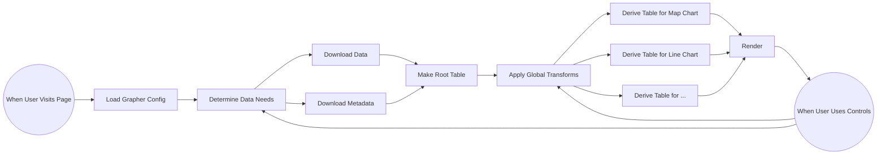

# Grapher

This folder contains the code for Grapher, our client side data exploration and visualization library. The Grapher pipeline is explained below.

## Step 1: The Grapher Config

The user navigates to a grapher page and the browser fetches the **Grapher Config**.

The _Grapher Config_ contains 3 main ingredients:

- Where to get the **Data** and **Metadata**
- Any **Transforms** to apply to the data
- What **Chart Components** to show

## Step 2: The Data

Once the **Grapher Library** has parsed the _Grapher Config_, it fetches the _Data_ from the URLs in that config (or in some cases the _Data_ is embedded right in the _Grapher Config_).

The _Data_ is downloaded in two pieces (though technically the second piece is optional):

1. The _Data_ in CSV (or TSV, JSON, etc). For example:

```
Country,GDP,Year
Iceland,123,2020
France,456,2020
...
```

2. The _Metadata_ about the **Columns** in the _Data_ (including source information). For example:

```
Column,Name,Source
GDP,Gross Domestic Product,World Bank
...
```

Then Grapher's **Table Library** parsed the _Data_ into memory as a **Table**. This _Table_ has **Rows** and _Columns_.

The initial _Table_ is called the **Root Table**.

## Step 3: Global Transforms

If the _Grapher Config_ specified any _Transforms_ such as filtering or grouping, the _Table Library_ will apply those.

For example, if a "Min Year Transform" is specified, rows earlier than that year will be filtered.

## Step 4: Child Tables

The _Grapher Library_ then derives one **Child Table** for each _Chart Component_ from the _Root Table_.

If the author specified different _Transforms_ for different _Chart Components_—i.e. a different year to show on the Map Component—those are applied.

All _Chart Components_ can now also make any changes they want to their _Child Table_ without affecting other _Chart Components_. If _Transforms_ are
made to the "Root Table", those changes automatically propagate down to all _Child Tables_.

## Step 5: Rendering

Now all the _Chart Components_ have all their own _Tables_ and Grapher renders to the user's screen.

As the user interacts with **Chart Controls**, changes are made to the respective _Tables_ and the visualizations update.

### Flowchart





## Embedding & Programmatic API

The Grapher package can be built as a standalone library or CDN bundle, allowing external applications or plain HTML pages to dynamically render Our World in Data visualizations.

### 1. Build Outputs

Running the build script produces the following outputs under `dist/`:

- `grapher.js`: The ES module library build. React and React DOM are marked as external peer dependencies (ideal for modern React apps or bundler environments).
- `grapher.bundle.js`: The standalone CDN bundle. All dependencies (including React and React DOM) are bundled, enabling plug-and-play usage directly in any HTML page.
- `grapher.css`: The stylesheet containing all Grapher layouts and components styles.
- `grapher.public.d.ts`: TypeScript declaration entry point for the public API.

To compile these assets:

```bash
cd packages/@ourworldindata/grapher
yarn build
```

---

### 2. Quick Start: CDN / Direct HTML Usage

For direct embedding on static sites or non-React applications, include the CSS stylesheet and import the bundle dynamically:

```html
<!DOCTYPE html>
<html lang="en">
    <head>
        <meta charset="utf-8" />
        <meta name="viewport" content="width=device-width, initial-scale=1" />
        <title>Embed Grapher</title>
        <!-- 1. Include Grapher Styles -->
        <link rel="stylesheet" href="path/to/dist/grapher.css" />
        <style>
            .my-chart-container {
                width: 100%;
                max-width: 800px;
                aspect-ratio: 850 / 600;
                border: 1px solid #ddd;
            }
        </style>
    </head>
    <body>
        <div id="chart" class="my-chart-container"></div>

        <script type="module">
            // 2. Import GrapherLoader from the standalone bundle
            import { GrapherLoader } from "./path/to/dist/grapher.bundle.js"

            // 3. Load from a CSV URL and mount it
            const chart = GrapherLoader.fromCsv({
                config: {
                    title: "My Custom Chart",
                    selectedEntityNames: ["France", "Germany"],
                },
                csvUrl: "./data.csv",
                columnDefs: [
                    {
                        slug: "indicator_slug",
                        type: "Numeric",
                        name: "Indicator Name",
                        unit: "units",
                    },
                ],
            })

            chart.mount(document.getElementById("chart"))
        </script>
    </body>
</html>
```

---

### 3. API Reference: `GrapherLoader`

The `GrapherLoader` class orchestrates dataset downloading, metadata normalization, state management, container sizing, and React rendering.

#### Static Factories

##### `GrapherLoader.fromTable({ config, data })`

Initializes a chart using an in-memory `OwidTable` instance. Excellent for cases where you already have data in memory.

- **`config`** (`GrapherInterface`): The standard Grapher configuration object (e.g. `title`, `selectedEntityNames`).
- **`data`** (`OwidTable`): An `OwidTable` instance containing the rows.

##### `GrapherLoader.fromCsv({ config, csvUrl, columnDefs })`

Asynchronously fetches and parses a remote CSV file, automatically creating an `OwidTable` inside Grapher.

- **`config`** (`GrapherInterface`): Grapher configuration.
- **`csvUrl`** (`string`): URL pointing to a CSV file. The file must include `entityName`, `entityCode`, `entityId`, and `year` (or `day`) columns, plus one or more value columns.
- **`columnDefs`** (`OwidColumnDef[]`, optional): Definitions describing the types, names, colors, and formatting of each column.

##### `GrapherLoader.fromApi({ config, dataApiUrl })`

Loads data directly from the Our World in Data Catalog/Indicators API.

- **`config`** (`GrapherInterface`): Grapher configuration. Must include a `dimensions` array listing the required variable/indicator IDs (e.g., `variableId: 1118466`).
- **`dataApiUrl`** (`string`, optional): Custom indicators base URL. Defaults to `"https://api.ourworldindata.org/v1/indicators/"`.

#### Instance Methods

- **`mount(container: HTMLElement): this`**
  Renders the chart inside the target container. Resizes of the container will be observed and automatically update the chart bounds.
- **`dispose(): void`**
  Unmounts the chart, cleans up the React root, and disconnects all observers.
- **`grapherState`** (`GrapherState`)
  The underlying mutable MobX state of the chart. You can read properties or modify them programmatically (e.g., changing `selectedEntityNames` on the fly).
