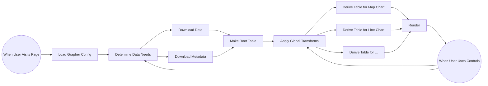

# Grapher

Grapher is [Our World in Data](https://ourworldindata.org/)'s client-side data exploration and visualization library. A chart is a JSON **config** (what to show: title, chart type, selected entities, …) plus the **data** it renders, which Grapher can ingest from several sources.

This readme first covers how to use Grapher as a standalone package — in a React app, with a bundler, or dropped into a plain HTML page — followed by notes for developing the package itself and an explanation of [how the library works internally](#how-grapher-works).

## Using the package

### Installation

(TBD)

`react` and `react-dom` (18 or 19) are peer dependencies of the library build; the CDN bundle described below has them baked in. The package is ESM-only.

Two things to include on any page that shows a chart:

- **Styles**: import `@ourworldindata/grapher/dist/grapher.css` (or link it as a stylesheet).
- **Fonts** (optional but recommended): charts are designed for **Lato** and **Playfair Display** and fall back to system fonts if they're absent. Load them yourself, or include OWID's font stylesheet like the demo pages do: `<link rel="stylesheet" href="https://ourworldindata.org/fonts.css" />`.

### Quick start: React / bundler

`GrapherLoader` is the main entry point: pick a data source via one of its static factories, then `mount` it into a container element.

```tsx
import { useEffect, useRef } from "react"
import { DimensionProperty, GrapherLoader } from "@ourworldindata/grapher"
import "@ourworldindata/grapher/dist/grapher.css"

function LifeExpectancyChart() {
    const ref = useRef<HTMLDivElement>(null)

    useEffect(() => {
        const loader = GrapherLoader.fromApi({
            config: {
                title: "Life expectancy",
                selectedEntityNames: ["World", "Africa", "Europe"],
                dimensions: [
                    { property: DimensionProperty.y, variableId: 1118466 },
                ],
            },
        }).mount(ref.current!)

        return () => loader.dispose()
    }, [])

    return <div style={{ aspectRatio: "850 / 600" }} ref={ref} />
}
```

The same code minus the React wrapper works in any bundler environment — `mount` just needs a sized container element.

### Quick start: plain HTML (CDN bundle)

For static sites or non-React applications, use the standalone bundle (`dist/grapher.bundle.js`), which includes React:

```html
<!doctype html>
<html lang="en">
    <head>
        <meta charset="utf-8" />
        <meta name="viewport" content="width=device-width, initial-scale=1" />
        <title>Embed Grapher</title>
        <!-- 1. Include Grapher styles (and, optionally, OWID's fonts) -->
        <link rel="stylesheet" href="https://ourworldindata.org/fonts.css" />
        <link rel="stylesheet" href="path/to/dist/grapher.css" />
        <style>
            .my-chart-container {
                width: 100%;
                max-width: 800px;
                aspect-ratio: 850 / 600;
                border: 1px solid #ddd;
            }
        </style>
    </head>
    <body>
        <div id="chart" class="my-chart-container"></div>

        <script type="module">
            // 2. Import GrapherLoader from the standalone bundle
            import { GrapherLoader } from "./path/to/dist/grapher.bundle.js"

            // 3. Load from a CSV URL and mount it
            GrapherLoader.fromCsv({
                config: {
                    title: "My Custom Chart",
                    selectedEntityNames: ["France", "Germany"],
                },
                csvUrl: "./data.csv",
                columnDefs: [
                    {
                        slug: "indicator_slug",
                        type: "Numeric",
                        name: "Indicator Name",
                        unit: "units",
                    },
                ],
            }).mount(document.getElementById("chart"))
        </script>
    </body>
</html>
```

### Loading data

`GrapherLoader` supports three data sources, one per factory:

| Factory     | Data source                            | Use when …                                          |
| ----------- | -------------------------------------- | --------------------------------------------------- |
| `fromTable` | an in-memory `OwidTable`               | you want to build or transform the table yourself   |
| `fromCsv`   | a CSV string, inline or fetched by URL | you have the data as CSV                            |
| `fromApi`   | the OWID data API (indicator IDs)      | you want to show Our World in Data's own indicators |

CSV data — whether passed inline (`csv`), fetched from a URL (`csvUrl`), or used to construct an `OwidTable` — must contain `entityName`, `entityCode`, and `entityId` columns plus a `year` (or `day`) column, followed by one or more value columns:

```js
import { GrapherLoader } from "@ourworldindata/grapher"

GrapherLoader.fromCsv({
    config: { title: "GDP per capita" },
    csv: `entityName,entityCode,entityId,year,gdpPerCapita
United States,USA,1,2000,36330
United States,USA,1,2020,63544`,
    columnDefs: [
        { slug: "gdpPerCapita", type: "Numeric", name: "GDP per capita" },
    ],
}).mount(container)
```

`fromTable` accepts the same data as a pre-built table (`new OwidTable(csvString, columnDefs)`), which is useful when you want to construct or transform the data programmatically before handing it to the chart.

For `fromApi`, the config's `dimensions` array says which indicators to fetch; indicator IDs can be found via the [OWID data catalog](https://docs.owid.io/projects/etl/api/). Data loading starts at construction time, so the chart shows a loading state until the data arrives.

### The chart config

The `config` object accepted by all three factories is a standard Grapher config (`GrapherInterface`) — the same format OWID stores for every chart on the site. The authoritative documentation of every field is the [JSON schema](https://files.ourworldindata.org/schemas/grapher-schema.011.json) (maintained in [`src/schema/`](./src/schema/)). Commonly used fields include `title`, `subtitle`, `note`, `chartTypes`, `tab`, `hasMapTab`, and `selectedEntityNames`.

### API reference: `GrapherLoader`

The `GrapherLoader` class orchestrates dataset downloading, metadata normalization, state management, container sizing, and React rendering.

#### Static factories

##### `GrapherLoader.fromTable({ config, data })`

Initializes a chart using an in-memory `OwidTable` instance. Excellent for cases where you already have data in memory.

- **`config`** (`GrapherInterface`): The standard Grapher configuration object (e.g. `title`, `selectedEntityNames`).
- **`data`** (`OwidTable`): An `OwidTable` instance containing the rows.

##### `GrapherLoader.fromCsv({ config, csv, csvUrl, columnDefs })`

Parses CSV data — passed inline or fetched from a URL — automatically creating an `OwidTable` inside Grapher.

- **`config`** (`GrapherInterface`): Grapher configuration.
- **`csv`** (`string`): CSV content as an inline string. Exactly one of `csv` and `csvUrl` must be given (the types enforce this). The CSV must include `entityName`, `entityCode`, `entityId`, and `year` (or `day`) columns, plus one or more value columns.
- **`csvUrl`** (`string`): URL pointing to a CSV file of the same format.
- **`columnDefs`** (`OwidColumnDef[]`, optional): Definitions describing the types, names, colors, and formatting of each column.

##### `GrapherLoader.fromApi({ config, dataApiUrl })`

Loads data directly from the Our World in Data Catalog/Indicators API.

- **`config`** (`GrapherInterface`): Grapher configuration. Must include a `dimensions` array listing the required variable/indicator IDs (e.g., `{ property: "y", variableId: 1118466 }`) — the types enforce this.
- **`dataApiUrl`** (`string`, optional): Custom indicators base URL. Defaults to `"https://api.ourworldindata.org/v1/indicators/"`.

#### Instance methods & properties

- **`mount(container: HTMLElement): this`**
  Renders the chart inside the target container. Resizes of the container will be observed and automatically update the chart bounds. Note that the chart renders lazily: it stays empty until the container is scrolled into view. Throws if the loader is already mounted; call `dispose()` first to re-mount.
- **`dispose(): void`**
  Unmounts the chart, cleans up the React root, and disconnects all observers.
- **`ready`** (`Promise<void>`)
  Resolves once the chart's data has loaded (immediately for `fromTable` and inline-CSV `fromCsv`). Rejects if fetching fails, in which case the chart stays in its loading state; failures are also logged to the console, so awaiting is optional.
- **`grapherState`** (`GrapherState`)
  The underlying mutable MobX state of the chart. You can read properties or modify them programmatically (e.g., changing `selectedEntityNames` on the fly).

### Sizing

The chart fills its container: give the container an explicit size (the `aspect-ratio: 850 / 600` used in the examples matches Grapher's default proportions) and the chart lays itself out to fit, re-rendering automatically when the container resizes. A container with zero width or height renders nothing — as does one that hasn't been scrolled into view yet, since rendering is lazy.

### TypeScript

The package ships bundled type declarations. Besides `GrapherLoader` and its option types (`FromTableOptions`, `FromCsvOptions`, `FromApiOptions`), it exports the types you need to build configs and column definitions: `GrapherInterface`, `OwidChartDimensionInterface`, `OwidColumnDef`, and the enums `DimensionProperty` and `ColumnTypeNames`.

One gotcha: fields like `columnDefs[].type` and `dimensions[].property` are enum-typed, so in TypeScript write `type: ColumnTypeNames.Numeric` and `property: DimensionProperty.y` where plain-JavaScript examples use `"Numeric"` and `"y"`.

### Other exports

- **`OwidTable`**: our dataframe class, for constructing in-memory data (see [Loading data](#loading-data)).
- **`Grapher`** and **`FetchingGrapher`**: the React components Grapher is built from, exported for advanced embedding scenarios (they're what OWID's own sites use). They require wiring up a `GrapherState` or OWID-specific endpoints — for almost all external use, `GrapherLoader` is the recommended entry point.

## Developing the package

### Build outputs

Running the build script produces the following outputs under `dist/`:

- `grapher.js`: The ES module library build. React and React DOM are marked as external peer dependencies (ideal for modern React apps or bundler environments).
- `grapher.bundle.js`: The standalone CDN bundle. All dependencies (including React and React DOM) are bundled, enabling plug-and-play usage directly in any HTML page.
- `grapher.css`: The stylesheet containing all Grapher layouts and components styles.
- `grapher.d.ts`: TypeScript declaration entry point for the public API.

To compile these assets:

```bash
cd packages/@ourworldindata/grapher
yarn build
```

### Testing the build outputs

Two tools help verify the built package (both expect `yarn build` to have run first):

- `yarn testPackage` runs the smoke tests in `packageTest/`: they import both JS builds, mount a chart from the built code into a DOM, and pack the package (`yarn pack`, which applies `publishConfig`) to typecheck a simulated external consumer against the bundled type declarations — with `moduleResolution: bundler` and `nodenext`, plus a full check of the declaration bundle itself and an [`@arethetypeswrong/cli`](https://github.com/arethetypeswrong/arethetypeswrong.github.io) pass over the tarball's types/exports wiring. These tests are intentionally not part of the repo-wide `yarn test` since they depend on `dist/`.
- `yarn startDemoServer` serves this directory on http://localhost:8433 via `http-server` and opens `/demo.html`, which shows the three `GrapherLoader` variants (`/core-econ-demo.html` is a styled embedding example). It's a plain static server, so the demo pages load `dist/` exactly like a CDN consumer would.

## How Grapher works

The Grapher pipeline, as it runs on ourworldindata.org, is explained below.

### Step 1: The Grapher Config

The user navigates to a grapher page and the browser fetches the **Grapher Config**.

The _Grapher Config_ contains 3 main ingredients:

- Where to get the **Data** and **Metadata**
- Any **Transforms** to apply to the data
- What **Chart Components** to show

### Step 2: The Data

Once the **Grapher Library** has parsed the _Grapher Config_, it fetches the _Data_ from the URLs in that config (or in some cases the _Data_ is embedded right in the _Grapher Config_).

The _Data_ is downloaded in two pieces (though technically the second piece is optional):

1. The _Data_ in CSV (or TSV, JSON, etc). For example:

```
Country,GDP,Year
Iceland,123,2020
France,456,2020
...
```

2. The _Metadata_ about the **Columns** in the _Data_ (including source information). For example:

```
Column,Name,Source
GDP,Gross Domestic Product,World Bank
...
```

Then Grapher's **Table Library** parsed the _Data_ into memory as a **Table**. This _Table_ has **Rows** and _Columns_.

The initial _Table_ is called the **Root Table**.

### Step 3: Global Transforms

If the _Grapher Config_ specified any _Transforms_ such as filtering or grouping, the _Table Library_ will apply those.

For example, if a "Min Year Transform" is specified, rows earlier than that year will be filtered.

### Step 4: Child Tables

The _Grapher Library_ then derives one **Child Table** for each _Chart Component_ from the _Root Table_.

If the author specified different _Transforms_ for different _Chart Components_—i.e. a different year to show on the Map Component—those are applied.

All _Chart Components_ can now also make any changes they want to their _Child Table_ without affecting other _Chart Components_. If _Transforms_ are
made to the "Root Table", those changes automatically propagate down to all _Child Tables_.

### Step 5: Rendering

Now all the _Chart Components_ have all their own _Tables_ and Grapher renders to the user's screen.

As the user interacts with **Chart Controls**, changes are made to the respective _Tables_ and the visualizations update.

### Flowchart


```mermaid
graph LR
UserVisitsPage((When User Visits Page))
UserVisitsPage --> Load[Load Grapher Config]
Load --> DataNeeds[Determine Data Needs]
DataNeeds --> Data[Download Data]
DataNeeds --> Metadata[Download Metadata]
Data --> RootTable[Make Root Table]
Metadata --> RootTable[Make Root Table]
RootTable --> GlobalTransforms[Apply Global Transforms]
GlobalTransforms --> ChildTable1[Derive Table for Map Chart]
GlobalTransforms --> ChildTable2[Derive Table for Line Chart]
GlobalTransforms --> ChildTableN[Derive Table for ...]
ChildTable1 --> Render
ChildTable2 --> Render
ChildTableN --> Render
Render --> UserEditsTransforms((When User Uses Controls))
UserEditsTransforms --> GlobalTransforms
UserEditsTransforms --> DataNeeds
```
