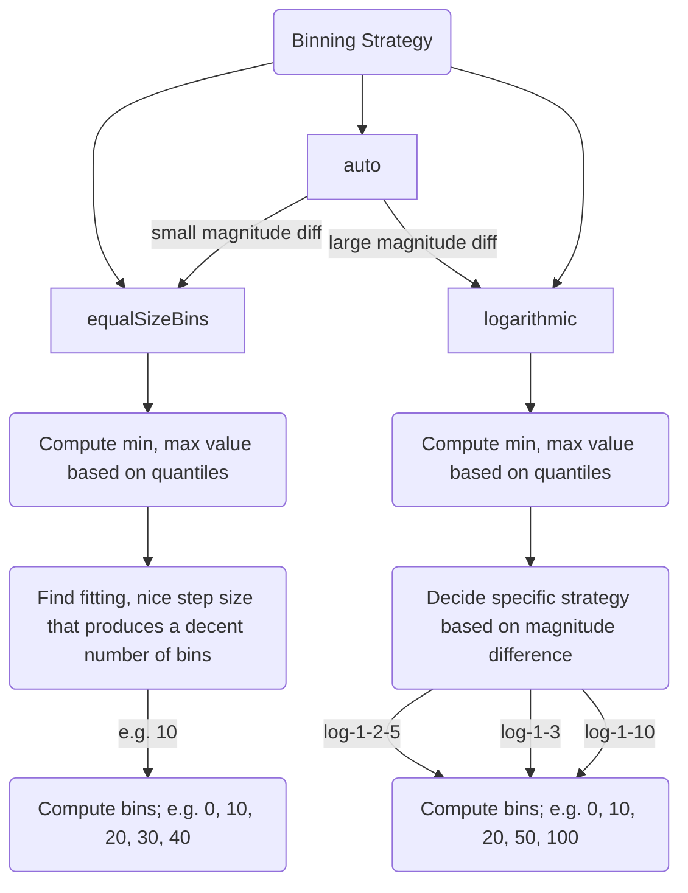

# Binning Strategies

Grapher supports several automatic binning strategies, and can also automatically choose the best strategy to use based on data.
One key input into choosing a suiting strategy is the (log10) magnitude difference, i.e. $\log_{10}(maxValue) - \log_{10}(minValue)$.
For example, the magnitude difference between 4 and 400 is 2, because $4 \cdot 10^{\mathbf 2} = 400$.

In general, if we have a high magnitude difference, we want to use a logarithmic binning strategy, and if we have a low one we want to use an equal-sized binning strategy.
We only compute the magnitude difference based on positive values, and don't take the lowest and highest values directly, but rather some low and high quantiles.

## Finding min & max values

To find the min and max values for binning, we use low and high quantiles instead of the raw min and max values.
This naturally removes outliers and will produce open-ended bins more often.

Min & max values can also be overridden manually in the admin.

Note that min & max values need to be non-zero positive numbers for log strategies, but can be any number for equal-size strategies.

## Equal-size strategy

For the equal-size strategy, we are differentiating between four different strategies:

- `equalSizeBins-normal` (default): creates 5-9 bins
- `equalSizeBins-few-bins`: creates fewer bins than that
- `equalSizeBins-many-bins`: creates more bins than that
- `equalSizeBins-percent`: creates bins of size 10% (0-10%, 10-20%, ...)

Note that `equalSizeBins-percent` is chosen automatically when we detect that the data is a percentage that's roughly in the 0-100% range.

Once we have resolved the strategy to use, we can then proceed to pick the step size to use. This process is based on a list of "known good" step sizes, which we choose in such a way that we arrive at a reasonable number of bins that is within the target range of bins.

## Logarithmic strategy

For logarithmic binning, we also differentiate between several strategies:

- `log-auto`: automatically chooses the best log binning strategy based on data, useful for when you want to force using a log strategy
- `log-1-2-5`: follows the 1, 2, 5, 10, 20, ... pattern
- `log-1-3`: follows the 1, 3, 10, 30, 100, ... pattern
- `log-1-10`: follows the 1, 10, 100, ... pattern

After picking out one of these strategies (either manually or automatically), the log strategy then produces bins such that they fill the range between `minValue` and `maxValue`.

## Midpoints & midpoint modes

Some of our charts also have natural midpoints, where we want to create a diverging color scale around the midpoint.
The most common natural midpoint is 0.

We have a bunch of different midpoint modes:

- `undefined` (automatic): chooses `symmetric` if there are values on both sides of the midpoint, otherwise chooses `none`
- `none`: disregards the midpoint
- `symmetric`: creates bins around the midpoint that are fully symmetric, i.e. there's the same number of bins on both sides, and they have the same distance from the midpoint
    - example: `-20, -10, -5, 0, 5, 10, 20`
- `same-num-bins`: creates (roughly) the same number of bins on both sides, but creates them independently, without regard to the distance from the midpoint
    - example: `-10, -5, -2, 0, 10, 20, 50`
- `asymmetric`: like `symmetric`, but then prunes any bins that are not below `minValue` or above `maxValue`
    - example: `-10, -5, 0, 5, 10, 20`

### NO integration with diverging color schemes

Note that currently, midpoints are not integrated with color scales.
This means that modes other than `symmetric` will not pick "good/bad" colors from a _diverging color scheme_ for the bins on both sides of the midpoint.
`symmetric` mode supports this, by virtue of it picking the same number of bins on both sides of the midpoint.

This is a feature that's clearly relevant, and it shouldn't be too hard to implement this in the future.
