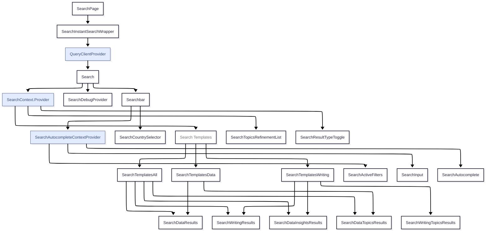
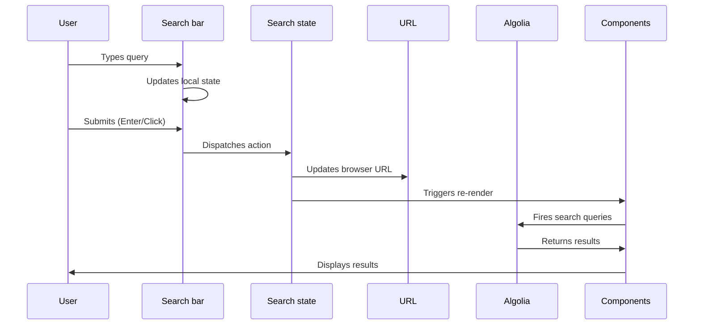

# Search Architecture Documentation

## Overview

This is the home of the site-wide search. It provides a unified search experience across charts, articles, data insights, and topic pages.

It has two main components:

1. **Search Bar**: A global search bar that provides autocomplete suggestions and allows users to filter results by country and topic.
2. **Search Results**: A collection of templates that render search results based on the user's query and selected filters.

## Key Architectural Patterns

### 1. Context API + Custom Hooks

- **Primary Context**: `SearchContext` manages global search state across components:
    - Search query
    - Selected filters (countries, topics)
    - Country filter mode
    - Result type ("data", "writing", "all")
- **Specialized Context**: `SearchAutocompleteContext` handles autocomplete-specific interactions for the search bar
- **Custom Hooks**: Business logic abstracted into reusable hooks (`searchHooks.ts`)

### 2. Template-Based Rendering

Uses exhaustive pattern matching with `ts-pattern` to determine the appropriate template based on:

```typescript
TemplateConfig = {
    resultType: SearchResultType   // "all" | "charts" | "writing"
    topicType: SearchTopicType     // "area" | "topic" | null
    hasCountry: boolean            // Country filters applied
    hasQuery: boolean              // User has entered search terms
}
```

Many template combinations currently result in the same component outputs, which can make this abstraction seem more complex than necessary. This is by design:

- to provide a good structure to reason about the variety of search templates
- to give us a sandboxed environment to surgically experiment with new templates with confidence

As the system matures, we might be able to express templating rules more succintly and remove this abstraction. The current system has been designed with this in mind. The template configurations are solely responsible for determining the presence and order of components in the search results. They are not used for any other logic, and are not passed down to the results components. This means that the concept of "template" can easily be replaced or removed in the future without affecting the underlying rendering layer.

### 3. Immutable State Management

- Reducer pattern with `searchReducer` for predictable state updates
- Bidirectional URL synchronization with browser history is handled by the `useUrlSync` hook (see `searchHooks.ts`)
- Only high-level search state (query, filters, result type, etc.) is stored globally in `SearchContext`. Autocomplete-specific state (such as active suggestion, suggestion list, and visibility) is managed separately in `SearchAutocompleteContext`, handled by `SearchAutocompleteContextProvider`. Search results state is managed locally within each search results component.

### 4. Component Data Fetching Responsibility

Each search result component is responsible for its own data fetching and local state management. The global `SearchContext` only stores the high-level search state (query, filters, result type, etc.), and does not hold any component-specific state or fetched data. This movement towards more stateful components originates from React Query architectural patterns, and ensures that components remain decoupled and can independently manage their own data requirements, making the system more modular and easier to maintain.

For example, in `SearchDataInsightsResults.tsx`, the component uses its own data-fetching hook (`useInfiniteSearch`) to retrieve and paginate results. The fetched data and pagination state are kept local to the component, rather than being stored in the global context. This pattern is followed throughout the search system, so each result component is self-contained and can be technically moved across all template combinations.

By convention, these stateful components follow the naming pattern `Search[...]Results.tsx`, where `[...]` corresponds to what is being queried (e.g. the component responsible for querying and rendering data insights is named `SearchDataInsightsResults.tsx`). Within each of these "Results" components, a React Query hook handles data fetching (and pagination logic, when appropriate) via a component-specific query function defined in `queries.ts`.

### 5. Server Side Generation (SSG)

Why is this page generated with SSG, even though all of the content is dynamic? The main advantage is that the topic tag graph is always available without requiring an additional request.

## Component Architecture



## Search State Lifecycle



## Integration Points

### Algolia Search Integration

- **Multiple Indices**: Separate search indices for different content types
- **Facet Filtering**: Dynamic filters for countries and topics
- **Search Analytics**: Algolia Insights for click tracking (pending porting from legacy system)

### React Query Integration

- **Regular Queries**: Standard search queries using an unpaginated `useQuery` for getting all writing or data topics.
- **Infinite Queries**: Paginated search results with `useInfiniteQuery` (wrapped in a custom `useInfiniteSearch` hook to handle Algolia-specific logic). Used in conjuction with the "Show more" button to load additional results on demand.
- **Hierarchical Cache Keys**: a structured approach to organize query invalidation, but no manual cache invalidation is currently necessary
- **Stale Time Management**: 1-minute cache for search results. We could technically go much higher since search results are only indexed once a week, but keeping this closer to the search session duration strikes a good balance between performance and freshness.

## Complex Implementation Details

### 1. Entity Extraction from Search Query

**Location**: `searchUtils.tsx:getAutocompleteSuggestionsWithUnmatchedQuery()`

Extracts entities (countries, topics) from the search query to apply filters.

### 2. URL <-> State Synchronization

**Location**: `searchHooks.ts:useUrlSync()`

Bidirectional synchronization between search state and browser URL.

## Development Patterns

- see .github/instructions/site.instructions.md for site-wide instructions.
- see .github/prompts/new_draft_search_component.prompt.md for a search component generation prompt.

## Analytics

- `useSearchAnalytics` hook to track search state changes
- ⚠️ logging of search results clicks (partially implemented, inherited from the legacy data catalog system)
- ⚠️ Algolia Insights (not ported over from the legacy search system)
